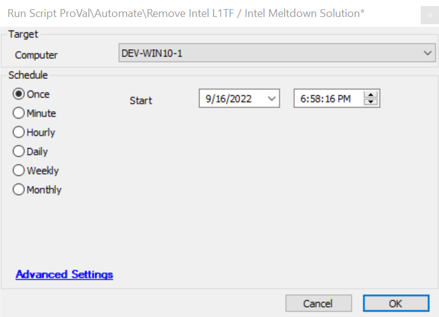

## Summary

The script will remove the Intel L1TF and Intel Meltdown solutions from the Automate environment.

## Sample Run

## Process

1. Remove "Intel L1TF Vulnerability Check" and "Intel Meltdown Vulnerability Check" scripts, if they exist.
2. Remove the "Intel L1TF Vulnerable" and "Intel Meltdown Vulnerable" groups.
3. Remove "Intel L1TF Vulnerable" and "Intel Meltdown Vulnerable" searches.
4. Remove "Intel L1TF Vulnerability Status" and "Intel Meltdown Vulnerability Status" dataviews.
5. Remove "Intel L1TF Vulnerability Status" and "Intel Meltdown Vulnerability Status" computer-level EDFs.
6. Remove the entry of the primary script from the `pendingscripts`, `runningscripts`, and `scheduledscripts` tables.
7. Remove the primary script ("Intel L1TF Vulnerability Check" and "Intel Meltdown Vulnerability Check").
8. Refresh the computer-level EDFs.

## Output

Script Log

