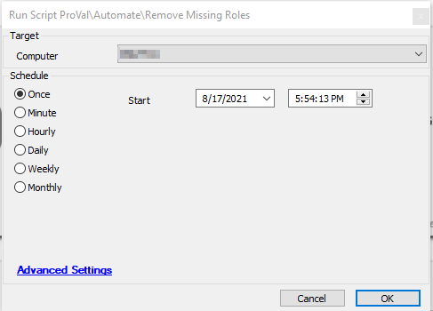

## Summary

This document outlines a process to remove roles that are still listed on machines but are no longer detected on them.

**Time Saved by Automation:** 5 Minutes

## Sample Run

## Process

- The script runs a SQL query against the database to delete the roles from the machines that are still listed but no longer detected on them.

