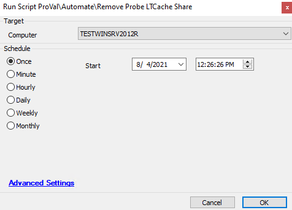

## Summary

This script will remove the current LTCache on the Probe for the target's location.

Time Saved by Automation: 5 Minutes

## Sample Run

## Dependencies

- Requires a probe to be setup

## Variables

- `@TargetComputerID@` = %computerid% (The computer you ran the script on)
- `@Computerid@` = %ProbeID% -> this targets the location probe 
- `@RemoveLTCachePSOut@` -> the output from the Powershell script

## Process

1. Sets the target computer to the computer the script ran on
2. Sets the probe target based on the computer's location
3. Runs the cleanup on the share
4. Updates the database to reflect the removal of the cache

## Output

- Script log

