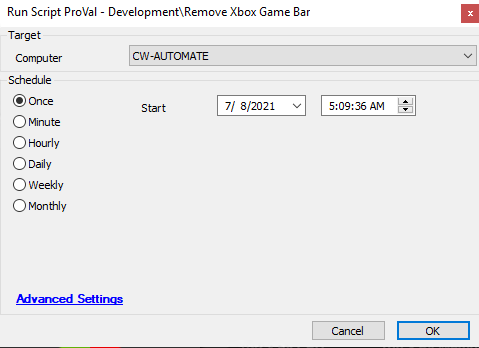

## Summary

This script will remove all Xbox packages, including the Xbox Game Bar, from the target system.

**Time Saved by Automation:** 10 Minutes

## Sample Run

## Process

- The script will run a PowerShell command that checks for online provisioned Xbox packages and attempts to remove them from the system.
- Error handling has been implemented in the script for logging purposes.

## Output

- Script log

