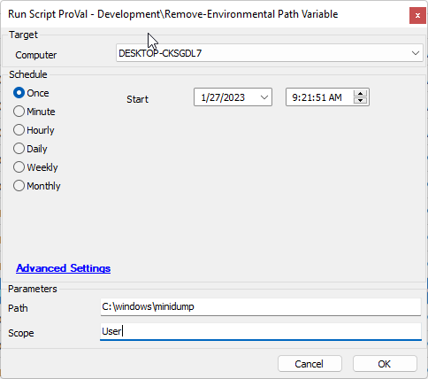
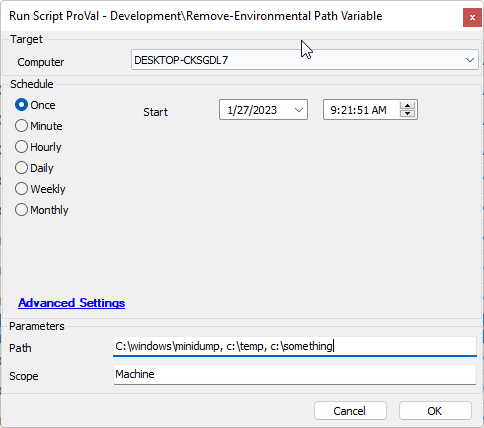

## Summary

This document will remove a requested Windows path from the environmental path variable for the desired scope.

## Sample Run

- To remove a user-scoped environmental path variable item.

- To remove multiple machine-scoped environmental path variable items.

**Note:** Scope is not mandatory; if left blank, the scope will default to the machine-scoped variable.

## Dependencies

- [EPM - Windows Configuration - Agnostic - Remove-PathVariable](<../../powershell/Remove-PathVariable.md>)

## Variables

Standard agnostic template variables apply.

### User Parameters

| Name  | Example                  | Required | Description                                                                                     |
|-------|--------------------------|----------|-------------------------------------------------------------------------------------------------|
| Path  | C:/windows, C:/temp...  | True     | The paths that must be removed from the scoped environmental path variable.                    |
| Scope | UserMachine              | False    | The scope of the environmental path variable you wish to target. This is defaulted to 'Machine' |

## Process

Please see the agnostic content document [EPM - Windows Configuration - Agnostic - Remove-PathVariable](<../../powershell/Remove-PathVariable.md>) for process information.

## Output

- Script log

