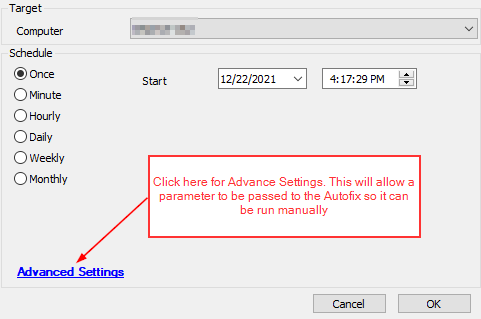
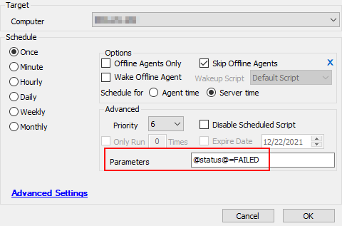

## Summary

This script is an Autofix script meant to be called from the monitor [ProVal - Development - Last scanned patch date > 7 days](https://proval.itglue.com/DOC-5078775-8918745).

## Sample Run

This script was designed to be called from a monitor.

To run this script manually, please see the below screenshots.



In the Advanced Settings --> Parameters area please enter in the following string of text:

```
@status@=FAILED
```



This will allow the script to be run manually instead of called by the monitor.

## Dependencies

This autofix script is called by the monitor [ProVal - Development - Last scanned patch date > 7 days](https://proval.itglue.com/DOC-5078775-8918745).

## Variables

- `%lastcmdoutput%` - This variable is used to review the data returned from the Resend Patch information commands.

## Process

1. The script will first verify the status of the monitor (or the parameter used to run manually mentioned above) and, if the patch scan was successful, will simply exit the script.
2. If the monitor is still in a failed state, the monitor will attempt to resend patches.
3. If the patch scan returns properly, the script will exit with a log message indicating the issue has been resolved.
4. If the patch scan failed again, the script will take the following actions:
   1. Set the WUAUSERV to "AutoStart"
   2. Start the WUAUSERV service
   3. Attempt to scan for patches again
5. The script will then verify if the patch scan is working properly. If the command completes successfully, the script will exit. If the command fails, the script will exit on error.

## Output

- Script log messages only
- Please reach out to [support@provaltech.com](mailto:support@provaltech.com) if you would like this solution to begin ticketing.


