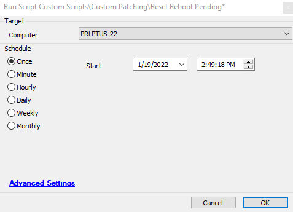
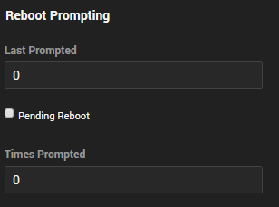

## Summary

This script is designed to be used with the monitor [EPM - Windows Configuration - Monitor - Reboot Pending [Prompt]](<../monitors/Reboot Pending Prompt.md>). The script's primary function is to clear the EDFs used in the monitor so it can be re-triggered at a later time.

## Sample Run

This script clears the EDFs used in the monitor [EPM - Windows Configuration - Monitor - Reboot Pending [Prompt]](<../monitors/Reboot Pending Prompt.md>) and the script [EPM - Windows Configuration - Script - User Prompt - Reboot](https://proval.itglue.com/DOC-5078775-9076644).

## Dependencies

The following items are dependent on this script:

- [EPM - Windows Configuration - Monitor - Reboot Pending [Prompt]](<../monitors/Reboot Pending Prompt.md>)
- [EPM - Windows Configuration - Script - User Prompt - Reboot](https://proval.itglue.com/DOC-5078775-9076644)

## Process

This script simply sets the following EDFs to 0 so that the user prompting stops and can be re-triggered:

## Output

No logging is performed with this script. It simply zeros out the required EDFs for the dependencies.
