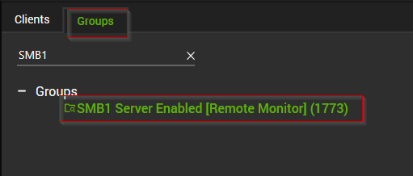
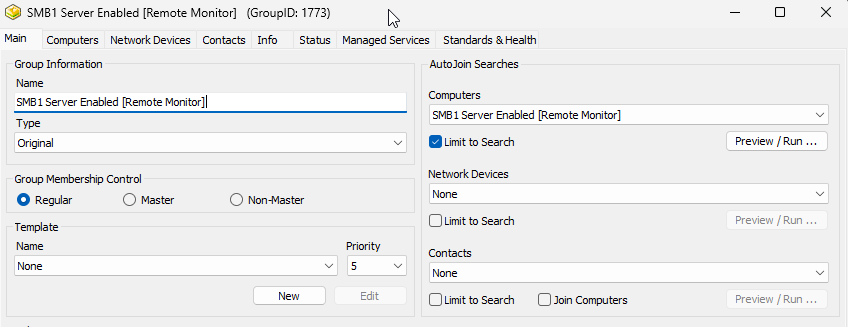
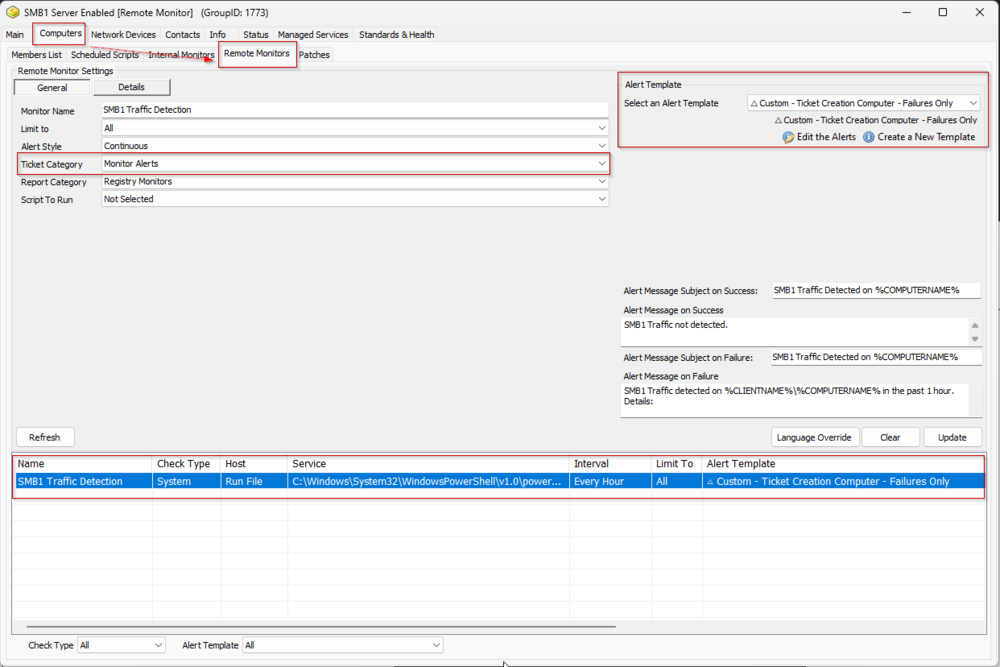
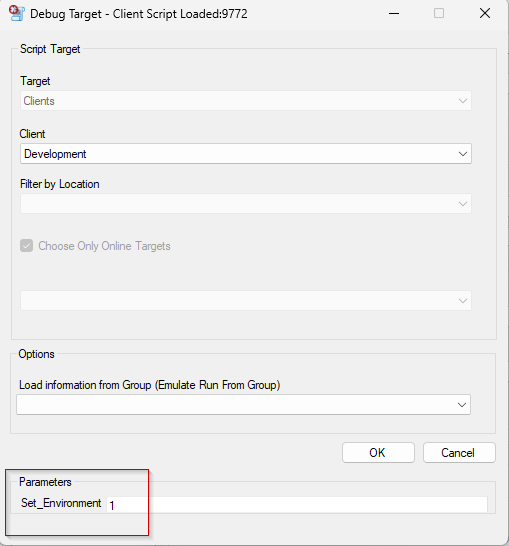
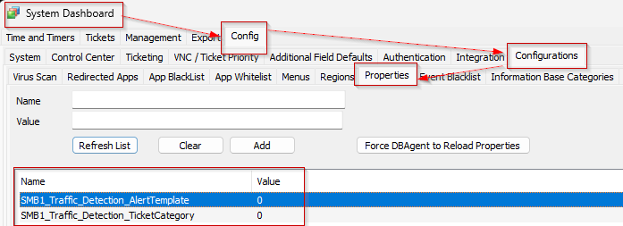
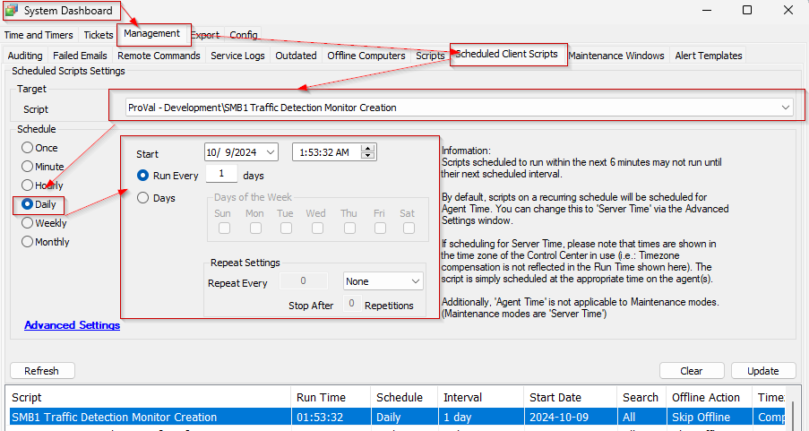
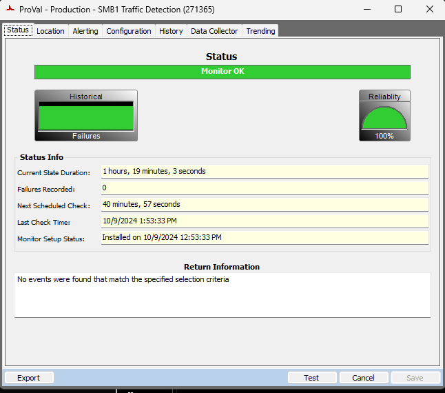
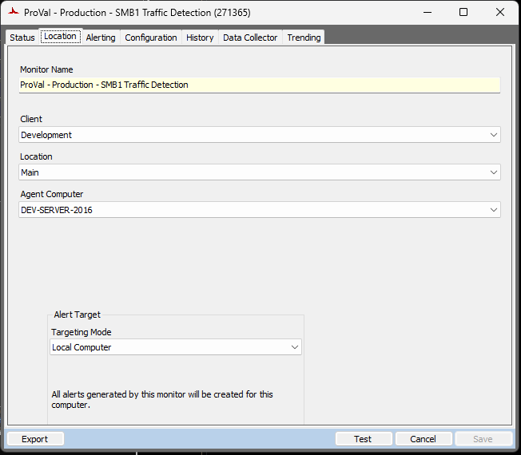
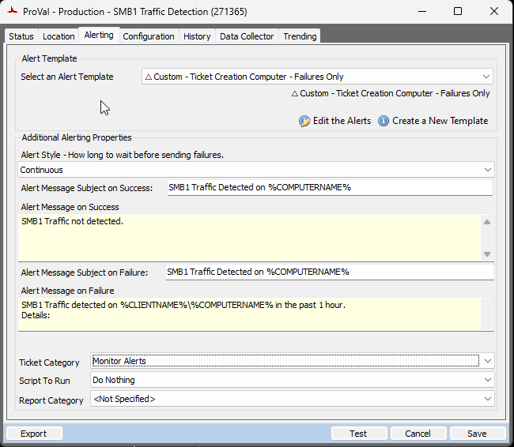
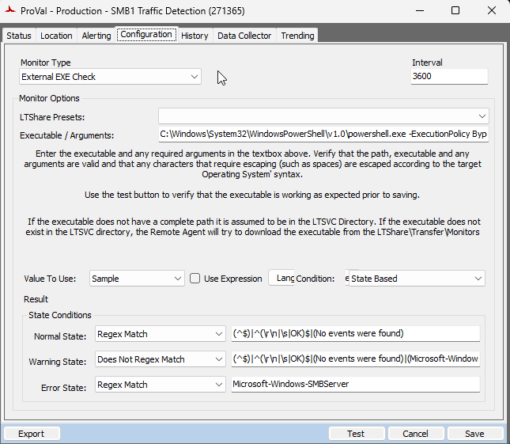

## Summary

This document outlines the process for creating Remote Monitors for SMB1 Traffic Detection. The creation of these remote monitors is governed by system properties, and computer-level Extra Data Fields (EDFs). These elements are further detailed within this document.

Remote monitors will be set up on computers where the [SMB1 Detection](<../monitors/SMB1 Detection.md>) remote monitor identifies the SMB1 Server Status as `Enabled`. In the [SMB1 Status [Remote Monitor]](<../dataviews/SMB1 Status Remote Monitor.md>) dataview, the `SMB1 Server Status` column will display `Enabled` for these machines.

**Note of Caution**: The remote monitors created by this script utilize PowerShell for monitoring. Therefore, its functionality is not guaranteed on any computer running a version of PowerShell older than 5. Please ensure your systems are updated to at least PowerShell version 5 for optimal performance.

## Implementation

1. **Gather existing ticket category and alert template id:**
   - Look for the `SMB1 Server Enabled [Remote Monitor]` group. Skip this step if the group does not exist.
     
   - Double click to open the group.
     
   - Navigate to `Computers` > `Remote Monitors`.
   - Select the `SMB1 Traffic Detection` remote monitor.
   - Take a note of Alert Template and Ticket Category applied to it.
     

2. **Import the** [**`SMB1 Traffic Detection Monitor Creation`**](https://proval.itglue.com/5078775/docs/17454586#version=draft&documentMode=edit) **script from the** `ProSync` **plugin.**

3. **Run/Debug the Script**
   - Execute or debug the script against a single client, with the `Set_Environment` parameter set to `1`. This action will generate the necessary system properties and Extra Data Fields (EDFs) for managing the remote monitors.
     
     Additionally, it will remove the following:
     - Group Remote Monitor: `SMB1 Traffic Detection`
     - Search: `SMB1 Server Enabled [Remote Monitor]`
     - Group: `SMB1 Server Enabled [Remote Monitor]`

4. **Reload System Cache**
   - Refresh the system cache to ensure all changes are updated.
     

5. **Configure System Properties and EDFs**
   - Navigate to the **System Dashboard --> Config --> Configurations --> Properties**.
   - Set the appropriate alert template and ticket category in their respective system properties for the monitor set.
     
   - Please read through the detailed System Properties and EDF explanations to understand how to configure any customizations.

6. **Schedule the Script**
   - Schedule the script to run once per day, preferably around midnight, from the dashboard for optimal results.
     

## Dependencies

- [EPM - Windows Configuration - Remote Monitor - SMB1 Detection](<../monitors/SMB1 Detection.md>)
- [CWA - Remote Monitor - SMB1 Detection](<../monitors/CWA - Remote Monitor - SMB1 Detection.md>)

## User Parameters

| Name                  | Example | Required                     | Description                                                                                                                                                   |
|-----------------------|---------|------------------------------|---------------------------------------------------------------------------------------------------------------------------------------------------------------|
| Set_Environment        | 1       | True (for first run only)   | Set it to 1 during the first run of the script to generate the necessary system properties and EDFs for managing the generated remote monitors.              |

## System Properties

| Name                                   | Example | Required | Description                                                                                                                                                                                                 |
|----------------------------------------|---------|----------|-------------------------------------------------------------------------------------------------------------------------------------------------------------------------------------------------------------|
| SMB1_Traffic_Detection_AlertTemplate   | 1       | True     | This system property stores the ID of the `Alert Template` to apply to the remote monitors created for the servers. The default value is '0'. i.e., `\<Not Selected>`. Navigate to the **System Dashboard --> Management --> Alert Templates** to find the ID of the required alert template. It is suggested to use the `△ Custom - Ticket Creation - Computer - Failures Only` alert for better alerting. The alert template should not be running the very same script for the Warning action as well unless you want to create a ticket for the PowerShell errors too. |
| SMB1_Traffic_Detection_TicketCategory  | 124     | False    | This system property stores the id of the `Ticket Category` to apply to the remote monitors created. The default value is '0'. i.e., `\<Not Specifed>`. Ticket Categories are used to control the CW Manage service board of the tickets generated by Automate. Navigate to the **System Dashboard --> Config--> Information Base Categories** to find the Id of the required ticket category. |

## Computer-Level EDF

| Name                                   | Type      | Section    | Description                                                                                                                                                                                                 |
|----------------------------------------|-----------|------------|-------------------------------------------------------------------------------------------------------------------------------------------------------------------------------------------------------------|
| SMB1_Traffic_Detection_Exclusion      | Check Box | Exclusions | Selecting this Extra Data Field (EDF) will exclude the computer from the SMB1 Traffic Detection monitoring. As a result, the script will not create any remote monitor for this computer. Furthermore, upon marking this EDF, the script will also remove any previously created remote monitor for this computer. |

## Remote Monitor Example

**Name:** `ProVal - Production - Memory Threshold Violation Monitor`

**Ticket Subject:** `SMB1 Traffic Detected on %COMPUTERNAME%`

**Alert Message on Failure:** `SMB1 Traffic detected on %CLIENTNAME%/%COMPUTERNAME% in the past 1 hour. Details:`
`%RESULT%`

**Sample Remote Monitor:**

## Output

- Remote Monitors

