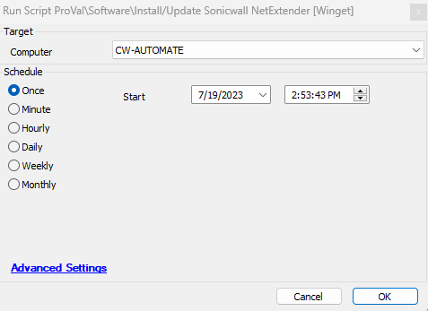

## Summary

This script attempts to install or update the SonicWall NetExtender application on the target device using Winget.

## Sample Run

## Variables

| Name           | Description                                                             |
|----------------|-------------------------------------------------------------------------|
| psout          | Stores the SonicWall NetExtender install/update result                  |
| LogContent     | Stores the content of the file `SonicWall.NetExtender-log.txt`        |
| DataLogContent | Stores the content of the file `SonicWall.NetExtender-data.txt`       |
| ErrorLog       | Stores the content of the file `SonicWall.NetExtender-error.txt`      |

## Process

This script performs the SonicWall NetExtender install/update using Winget. It can be run directly or scheduled with the monitor [SonicWall NetExtender Deployment](<../monitors/SonicWall NetExtender Deployment.md>).

**Note:** This script needs to be scheduled on at least one machine permanently so that the maximum version keeps updating in the database to trigger the monitor for the update of the SonicWall NetExtender on all agents where it is installed.

## Output

- Script Log
