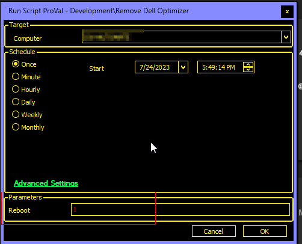
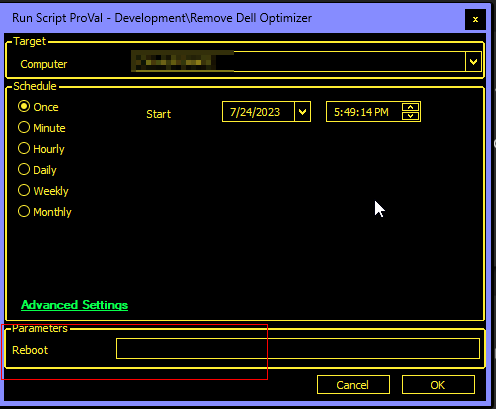

## Summary

The purpose of the script is to remove the `Dell Optimizer` application from Dell computers. The computer needs to be restarted to remove the application completely.  

**Note:** The script will not reboot the computer unless the user parameter `Reboot` is set to `1`.

## Sample Run

Set the value for the user parameter `Reboot` to `1` to forcefully restart the computer after uninstalling the application.  
  

Leave the parameter blank to restart the computer manually.  
  

#### User Parameters

| Name   | Example | Required | Description                                                                                     |
|--------|---------|----------|-------------------------------------------------------------------------------------------------|
| Reboot | 1       | False    | Set it to `1` to restart the computer after removing the application. Leave it blank to restart the computer later/manually. |

## Output

- Script Log

