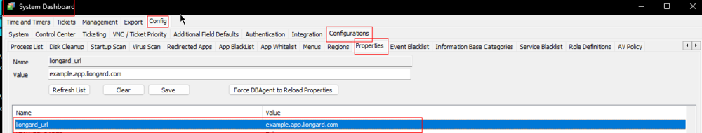
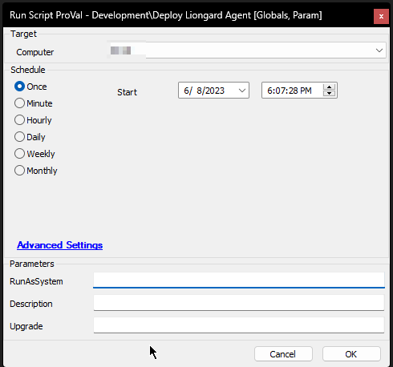
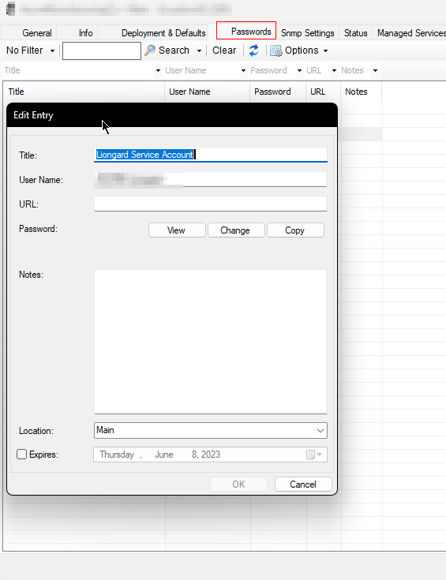
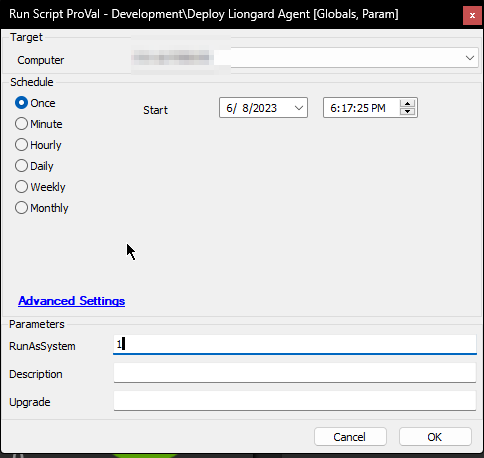
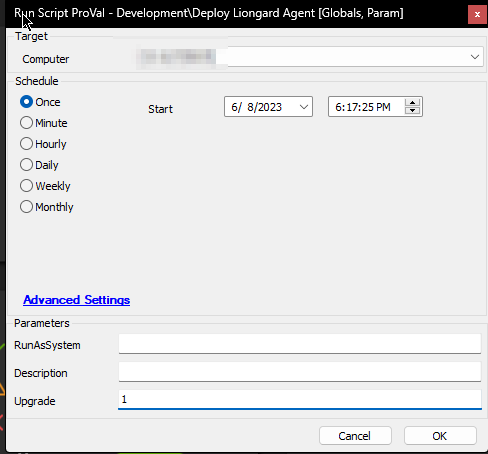
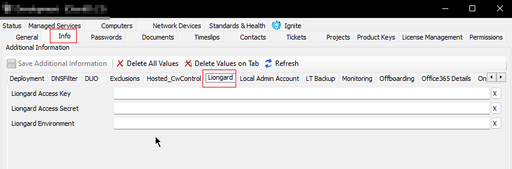

## Summary

The purpose of the script is to install the [latest available version of the Liongard Agent](https://agents.static.liongard.com/LiongardAgent-lts.msi). The script provides an option to run the `Liongard Agent` service as `LocalSystem` or with a `custom credential`. It can also be used to upgrade an older installation to the latest version.

## Implementation

- Import the script.
- Reload System Cache.
- Create the `liongard_url` system key and set the respective URL in it.  
  

## Sample Run

**To run the `Liongard Agent` Service with the credentials saved at the location-level `Passwords` tab as `Liongard Service Account`:**  
  
**The `Liongard Service Account` password entry must be saved at the location-level `Passwords` tab for the script to run the service with these credentials.**  
  

**To run the installed `Liongard Agent` service as `LocalSystem`:**  
  

**Attempt to upgrade to the latest available version:**  
  

## Dependencies

The script will work as long as this download URL is active:  
[https://agents.static.liongard.com/LiongardAgent-lts.msi](https://agents.static.liongard.com/LiongardAgent-lts.msi)

## Variables

| Name              | Description                        |
|-------------------|------------------------------------|
| AccessKey         | Liongard Access Key                |
| Secret            | Liongard Secret                    |
| Environment       | Liongard Environment                |
| LiongardURL       | Liongard URL                       |
| Username          | Service User                       |
| Password          | Password of the service user       |
| AppName           | LiongardAgent                      |
| WorkingDirectory   | C:/ProgramData/_automation/script/LiongardAgent |
| Installer         | C:/ProgramData/_automation/script/LiongardAgent/LiongardAgent.msi |

#### Global Parameters

| Name                     | Example                     | Required | Description                                                                                           |
|--------------------------|-----------------------------|----------|-------------------------------------------------------------------------------------------------------|
| LiongardCredentialsTitle | Liongard Service Account     | True     | Title of the credentials to run the `Liongard Agent` service after installing the application.       |

#### User Parameters

| Name        | Example                           | Required | Description                                                                                           |
|-------------|-----------------------------------|----------|-------------------------------------------------------------------------------------------------------|
| RunAsSystem | 1                                 | False    | Set it to 1 to run the `Liongard Agent` service as `LocalSystem`                                    |
| Description | Domain Controller of the Environment | False | Agent Description; it will fall back to the `\\<computername>` if left blank                           |
| Upgrade     | 1                                 | False    | Set it to 1 to attempt to upgrade the application to the latest available version                    |

#### System Properties

| Name         | Example              | Required | Description                                              |
|--------------|----------------------|----------|----------------------------------------------------------|
| liongard_url | usXX.app.liongard.com| True     | Liongard URL to be used to install the application       |

## Client-Level EDF

| Name                     | Example                     | Required | Description                                      |
|--------------------------|-----------------------------|----------|--------------------------------------------------|
| Liongard Access Key      | 12fe3456cd67def89abc2       | True     | Liongard Access Key of the client                |
| Liongard Access Secret    | d02bded900b42440b82292bee20bb449d24db9be4e2802808b0444209e8249dd | True | Liongard Secret of the client                    |
| Liongard Environment      | ProValTech                  | True     | Client Name in Liongard Portal                   |  
  

## Output

- Script Logs

