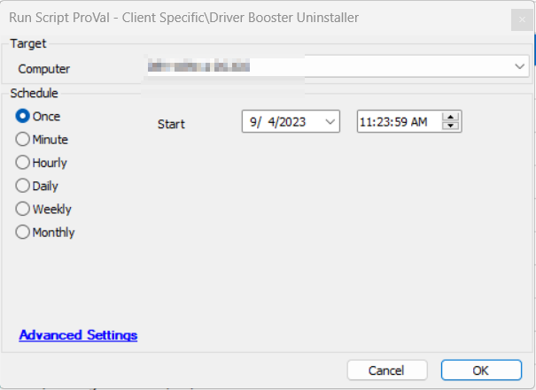

## Summary

The purpose of the script is to uninstall any version of Driver Booster from the machine.

## Implementation

- Import the script.
- Import the internal monitor "ProVal - Client Specific - Uninstall Driver Booster".
- Run the script as an Autofix with the above monitor.
- Additionally, it can be run independently against any Windows machine.

## Sample Run

## Output

- Script Logs

