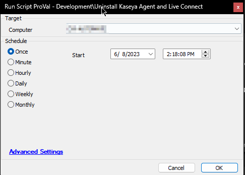

## Summary

The purpose of the script is to remove `Kaseya Agent` and `Live Connect` applications from Windows computers.

## Sample Run

## Variables

| Name        | Description                                                        |
|-------------|--------------------------------------------------------------------|
| ShellResult | Output of PowerShell script attempting to remove the applications.  |

## Output

- Script Log

