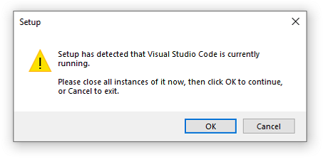
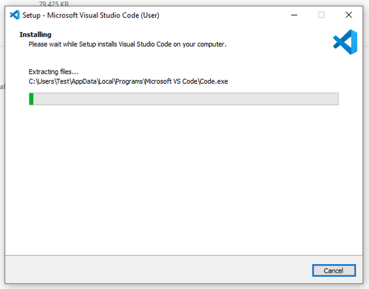
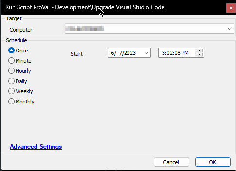

## Summary

The purpose of the script is to update the installed version of the Visual Studio Code to the latest available version.

If `User Installer` is installed then the user must be logged on to the computer for the script to work. If the user is using the application then they will be prompted to close:  

The Application cannot be upgraded if it's running.  

This prompt is inevitable for computers with the `User Installer` version of the application installed and should not be canceled:  

**Note:** The script cannot be used to install a new instance of the application.

## Sample Run

## Variables

| Name          | Description                                         |
|---------------|-----------------------------------------------------|
| LatestVersion | Latest Version of the application released by Microsoft |
| DownloadURL   | URL to download the latest version of the application |
| Log           | Script Log to write before exiting                   |

## Output

- Script Logs

