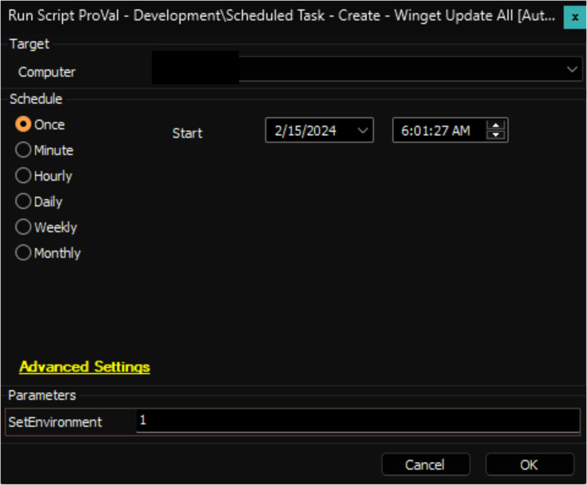
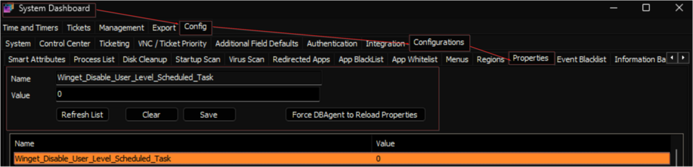
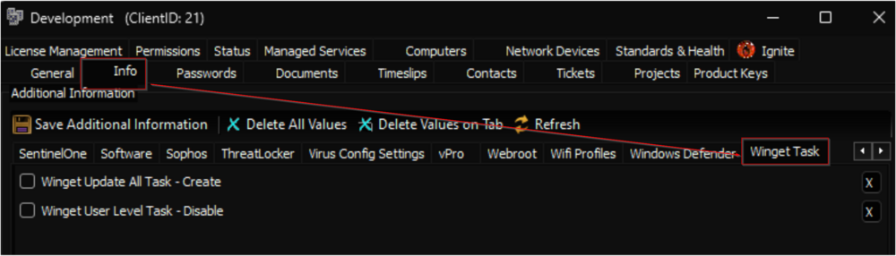
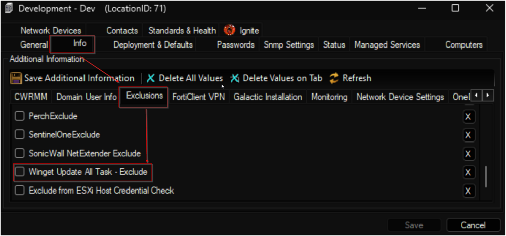
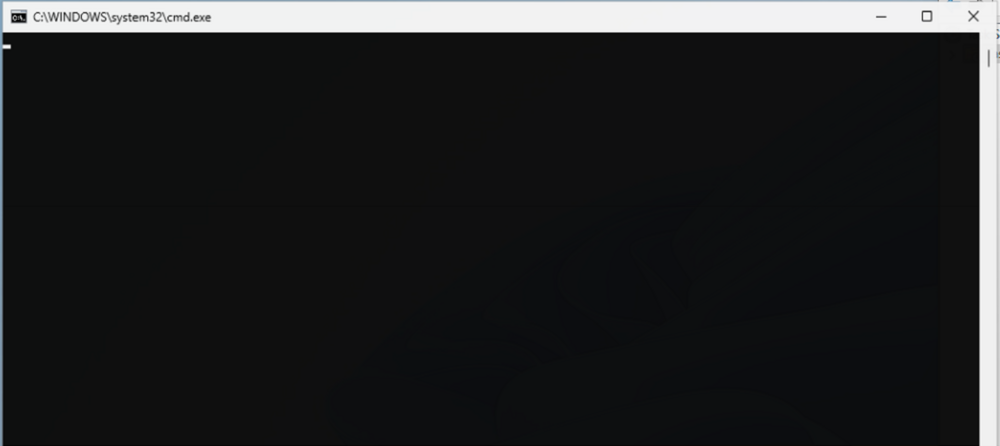

## Summary

The script establishes two scheduled tasks on the computer: `Winget Update All [System]` and `Winget Update All [Logged on User]`. The `Winget Update All [System]` task executes the Winget's upgrade of all commands upon system boot (after network connection) under the SYSTEM context. Meanwhile, the `Winget Update All [Logged on User]` task initiates the Winget's upgrade of all commands upon user login.

The system property `Winget_Disable_User_Level_Scheduled_Task` can be used to enable the `Winget Update All [Logged on User]` task. By default, `Winget_Disable_User_Level_Scheduled_Task` is set to 1, which is disabled.

 Be sure that user-level scheduled tasks `Winget Update All [Logged on User]` may prompt for UAC to the logged-in user if enabled. 

**Note:** The script is explicitly limited to Windows 10 and 11.

## Sample Run

For the initial execution of the script, target any online Windows 10 or Windows 11 computer. Set the `SetEnvironment` parameter to `1` to create the system property and the EDF.

Regular execution of the script:

## User Parameters

| Name                | Example | Mandatory | Description                                                                                     |
|---------------------|---------|-----------|-------------------------------------------------------------------------------------------------|
| SetEnvironment       | 1       | False     | Set the `SetEnvironment` parameter to `1` during the initial execution of the script to create the system property and EDF. |

## System Properties

| Name                                          | Default | Mandatory | Description                                                                                                           |
|-----------------------------------------------|---------|-----------|-----------------------------------------------------------------------------------------------------------------------|
| Winget_Disable_User_Level_Scheduled_Task     | 1       | False     | Set the `Winget_Disable_User_Level_Scheduled_Task` System Property to `0` to enable the `Winget Update All [Logged on User]` task on the endpoints. |

## Client Level EDF

| Name                               | Type      | Section     | Description                                                                                          |
|------------------------------------|-----------|-------------|------------------------------------------------------------------------------------------------------|
| Winget Update All Task - Create    | Check-Box | Winget Task | Marking this EDF will enable the Winget Upgrade All Tasks creation on the endpoints of the client.   |
| Winget User Level Task - Disable    | Check-Box | Winget Task | Mark this EDF to disable the `Winget Update All [Logged on User]` task on the endpoints of the client. |

## Location Level EDF

| Name                               | Type      | Section     | Description                                                                                          |
|------------------------------------|-----------|-------------|------------------------------------------------------------------------------------------------------|
| Winget Update All Task - Exclude    | Check-Box | Exclusions  | Marking this EDF will exclude the computers from the Winget Update - All task creation solution.     |

## Computer Level EDF

| Name                               | Type      | Section     | Description                                                                                          |
|------------------------------------|-----------|-------------|------------------------------------------------------------------------------------------------------|
| Winget_update_all_task_created     | Check-Box | Default     | The EDF tracks the success of task creation on each computer. After successfully creating the tasks, the script sets a flag in this EDF. The [Internal Monitor - Execute Script - Scheduled Task - Create - Winget Update](https://proval.itglue.com/DOC-5078775-14825214) will not target machines where this EDF is flagged. Resetting this EDF, as described in the [Reset - Extra Data Field - Winget_update_all_task_created](https://proval.itglue.com/DOC-5078775-14825940) article, will prompt the internal monitor to execute the script again. This EDF should not be updated manually. |
| Winget Update All Task - Exclude    | Check-Box | Exclusions  | Marking this EDF will exclude the computer from the Winget Update - All task creation solution.     |

## Additional Notes

When the `Winget Update All [Logged on User]` task is enabled, a command window will briefly appear on the user's screen within a few minutes after they log in. This window will continue to pop up every time the task runs, i.e., when the user logs in again after logging out or restarting the computer. The total time it will be on the screen is a second or two, but it might create questions from certain clients.

## Output

- Script log
- Extra Data Field

