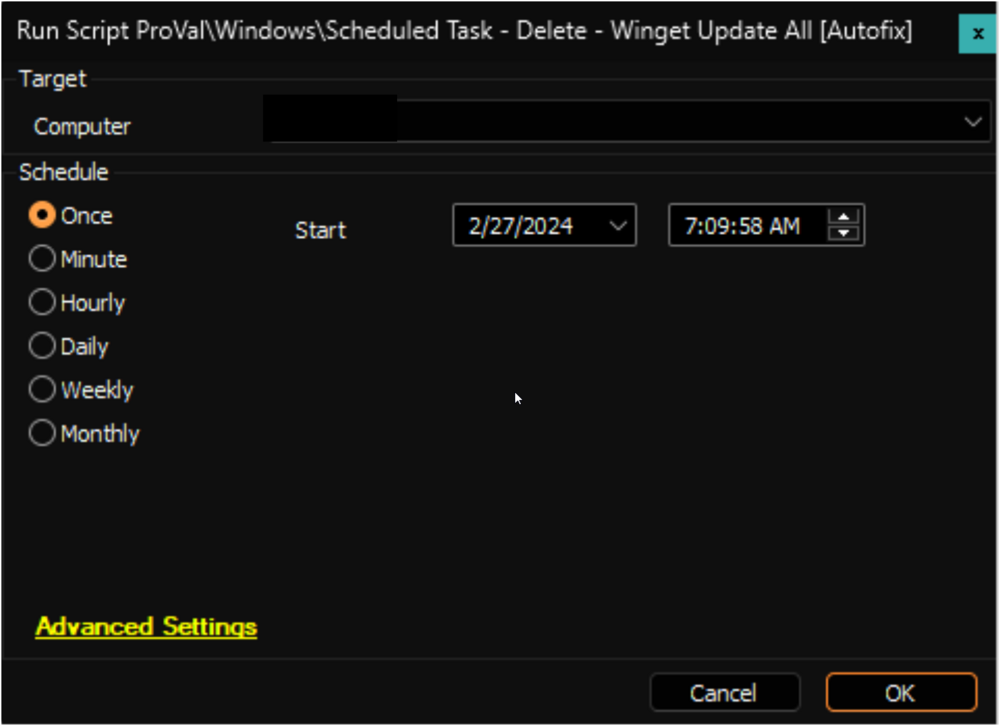

## Summary

The script removes the `Winget Update All [System]` and `Winget Update All [Logged on User]` tasks created by the [Script - Scheduled Task - Create - Winget Update All [Autofix]](<./Scheduled Task - Create - Winget Update All Autofix.md>) script from Windows 10 and 11 machines.

## Sample Run

## Dependencies

- [Script - Scheduled Task - Create - Winget Update All [Autofix]](<./Scheduled Task - Create - Winget Update All Autofix.md>)
- [Internal Monitor - Execute Script - Scheduled Task - Delete - Winget Update All](<../monitors/Execute Script - Scheduled Task - Delete - Winget Update All.md>)

## Computer Level EDF

| Name                          | Type      | Section | Description                                           |
|-------------------------------|-----------|---------|-------------------------------------------------------|
| Winget_update_all_task_created | Check-Box | Default | The script will unmark this EDF after removing the tasks. |

## Output

- Script log
- Extra Data Field

