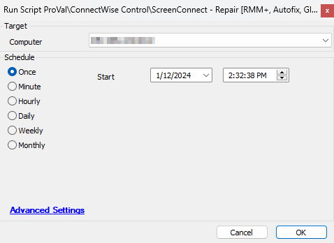

## Summary

The script can be used to repair non-functional or broken ScreenConnect clients on agents. It supports both Windows and Mac machines and is limited to ScreenConnect integrated with Automate only. 

The script uses an RMM+ solution to verify the computer's status in the ScreenConnect portal before and after attempting to repair it.

Tickets can be created for failed attempts if the proper ticket category ID is set in the global variable `ticketcreationcategory`.

Additionally, the script will send an email to [alerts@provaltech.com](mailto:alerts@provaltech.com), creating a ticket in ProVal's Autotask if the RMM+ solution is not properly configured in the client's environment.

## Sample Run



## Dependencies

- [CWM - Automate - RMM+ Plugin Configuration](<./CWM - Automate - RMM+ Plugin Configuration.md>)
- [Manual Troubleshooting - ScreenConnect Orange Icon](<./Manual Troubleshooting - ScreenConnect Orange Icon.md>)

## Global Parameters

| Name                   | Default | Required | Description                                                  |
|------------------------|---------|----------|--------------------------------------------------------------|
| ticketcreationcategory  | 0       | Semi     | Set ID of the required ticket category to create a ticket on failures |

## Output

- Script log.
- Tickets

## Ticketing

**Subject:** `ScreenConnect - Failed - %ClientName%//%ComputerName%`

**Ticket Body for Session GUID issue:**  
```
Autofix failed to fix ScreenConnect's issue for %ClientName%//%ComputerName%
Reason: Script was unable to set the session GUID on the machine post-installation.
Please reinstall the ScreenConnect Client manually on the computer.
Manual Troubleshooting guide: https://proval.itglue.com/DOC-5078775-13282507
```

**Ticket Body for installation failure:**  
```
Autofix failed to fix ScreenConnect's issue for %ClientName%//%ComputerName%
Reason: Script was unable to install the ScreenConnect Client on the machine.
Install Command Result: @InstallResult@
Please reinstall the application manually.
Manual Troubleshooting guide: https://proval.itglue.com/DOC-5078775-13282507
```

**Ticket Body for uninstallation failure:**  
```
Autofix failed to fix ScreenConnect's issue for %ClientName%//%ComputerName%
Reason: Automate has executed the autofix script 3 times over the last 7 days, but the problem still persists.
Please reinstall the ScreenConnect Client manually on the computer.
Manual Troubleshooting guide: https://proval.itglue.com/DOC-5078775-13282507
```

**Ticket Body for more than 3 attempts in a week:**  
```
Autofix failed to fix ScreenConnect's issue for %ClientName%//%ComputerName%
Reason: Automate has executed the autofix script 3 times over the last 7 days, but the problem still persists.
Please reinstall the ScreenConnect Client manually on the computer.
Manual Troubleshooting guide: https://proval.itglue.com/DOC-5078775-13282507
```
