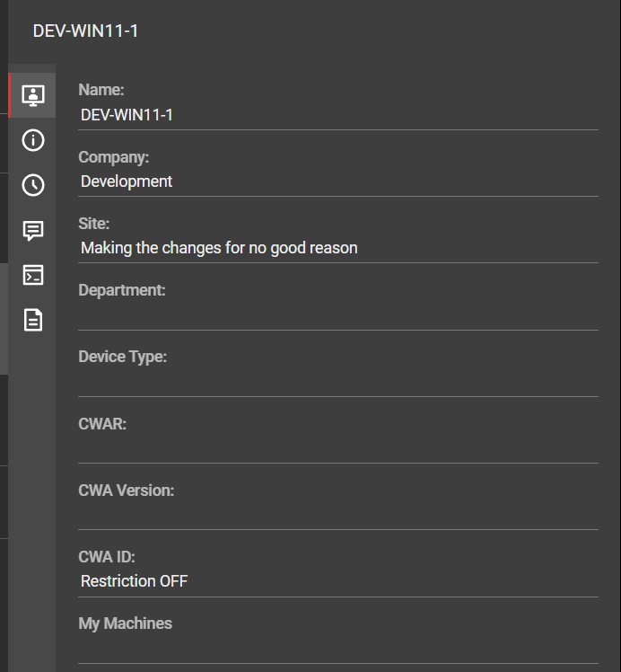
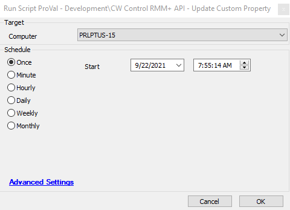

## Summary

This script will set a custom property in CW Control for the matching system in the CW Control portal using the matching GUID.

User properties for the Custom Property Index and the Property Value need to be set before running the script.

**Time Saved by Automation:** 5 Minutes

## Sample Run

**Target:** Any machine with CW Control installed

## Dependencies

[CWM - Automate - RMM+ Plugin Configuration](<./CWM - Automate - RMM+ Plugin Configuration.md>)

#### Variables

| Name                | Description                                                                                     |
|---------------------|-------------------------------------------------------------------------------------------------|
| sccomputerguid      | The GUID of the CW Control instance                                                             |
| SCUrl               | The URL for the CW Control portal                                                               |
| Port                | The port in use for CW Control                                                                   |
| SCFormattedURL      | A formatted URL to work properly with the RMM+ extension in CW Control                         |
| SCCommandURL        | The URL to end sessions related to the RMM+ Plugin                                             |
| pluginresult        | The output of the results from the command run above.                                          |

## User Parameters

| Name           | Example | Required | Description                                                                                                                                                                                                                                 |
|----------------|---------|----------|---------------------------------------------------------------------------------------------------------------------------------------------------------------------------------------------------------------------------------------------|
| PropertyIndex   | 5       | True     | This is the custom property in CW Control that you want to set. Properties 1-4 are used by the CWA / CWC plugin. It is suggested to start with Properties 5-8. This video can explain how to set them up in CWC. [Watch Video](https://www.youtube.com/watch?v=KgtLfEkAdwM) |
| PropertyValue   | True    | True     | This is the value you want to set for the Custom Property                                                                                                                                                                                |

#### System Properties

| Name                           | Example                               | Required | Description                                                                                                                                                                                                                     |
|--------------------------------|---------------------------------------|----------|---------------------------------------------------------------------------------------------------------------------------------------------------------------------------------------------------------------------------------|
| RMMPlus_AccessKey              | ajw8fh2p93ufn;o31ifu2091j23oif      | True     | This is the key set up in the CW Control RMM+ Plugin so Automate can reach out to gain access to the API.                                                                                                                    |
| RMMPlus_Headers                | Origin: [site.site.com](http://site.site.com/) | True     | This is the URL (without http/https) for the CW Control server. This value needs to match the value in the RMM+ Plugin configuration in CW Control.                                                                           |
| RMMPlus_StaleAgentThreshold     | 30                                    | True     | The number of days to indicate what a "stale" agent is to the scripts. 30 is the default.                                                                                                                                     |
| RMMPlus_Timeout                | 1000                                  | True     | The default timeout for commands run via RMM+ through Automate. 1000 is the default.                                                                                                                                         |

## Output

Script log messages only.
