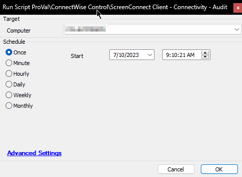

## Summary

This script will return a variable (`@Online@`) as 0, 1, -2, -3, or -4.  
- **0**: Offline  
- **1**: Determining if the target machine is online in Control  
- **-2**: The [CW RMM+ Plugin Configuration](https://proval.itglue.com/5078775/docs/9770217) is broken in the environment  
- **-3**: The Machine Error can be anything  
- **-4**: The Agent GUID was not set appropriately to 32 characters excluding the (-) lengths, i.e., 4.

An email will be sent to `Alerts@provaltech.com` if the RMMPlus solution is not properly configured.

**Subject**: Incorrect RMM_Plus Configuration - %redirhostname%

**Body**:

RMM_Plus is not properly configured for %redirhostname%. Please get this fixed as soon as you can.  
Reference: [https://proval.itglue.com/5078775/docs/9770217](https://proval.itglue.com/5078775/docs/9770217)

**Time Saved by Automation**: 10 Minutes

## Sample Run

## Dependencies

[CW RMM+ Plugin Configuration](https://proval.itglue.com/5078775/docs/9770217)

#### System Properties

| Name                  | Example                | Required | Description                                                                                         |
|-----------------------|------------------------|----------|-----------------------------------------------------------------------------------------------------|
| RMMPlus_AccessKey     | abc4cudf2er$%          | True     | This will be the access key that is set in the RMM+ extension on the Control server.              |
| RMMPlus_Timeout       | 1000                   | True     | The command timeout. The ProVal standard is to set this to 1000.                                  |
| RMMPlus_Headers       | labtech.provaltech.com  | True     | Origin: automate.yourserver.com                                                                     |
| RMMPlus_IsBroken      | 1                      | False    | Script will set this property to ensure that it does not send another email to [alerts@provaltech.com](mailto:alerts@provaltech.com) for the improperly configured RMM+ solution. |

#### Script States

| Name                             | Example                   | Description                                                                                                                                                                                                         |
|----------------------------------|---------------------------|---------------------------------------------------------------------------------------------------------------------------------------------------------------------------------------------------------------------|
| OnlineInScreenConnectSinceMinutes | session not found, 12234, -1213 | Outcome of the plugin result. Usually the time in minutes for which the computer is online in ScreenConnect. (-ve time indicates that the machine is offline for that many minutes). This state is further used as the "Command Result" column of [CWM - Automate - Dataview - Agent - Agent Check-in Health](<../dataviews/Agent - Agent Check-in Health.md>) dataview. |

## Output

- Script log
- Script state
- Email

