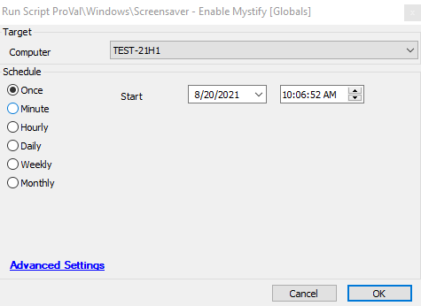

## Summary

Creates a scheduled task that will enable the screensaver for the specified number of seconds for all users. The screensaver settings will be applied at the next log-on of each user.

Time Saved by Automation: 10 Minutes

## Sample Run

### Global Parameters

| Name            | Example | Required | Description                                                              |
|-----------------|---------|----------|--------------------------------------------------------------------------|
| TimeoutSeconds  | 900     | True     | The number of seconds before the screensaver will be started.           |
| PromptForLogin  | 1       | True     | Set 0 to not prompt for login after waking, or 1 to prompt.            |

## Process

The script will run a PowerShell script to create a scheduled task that will enable the screensaver for the specified number of seconds for all users. The screensaver settings will be applied at the next login of each user. The PowerShell uses 2 global variables `@TimeoutSeconds@` and `PromptForLogin` set inside the Globals and Parameters tab of the script.

## Output

- Script log

