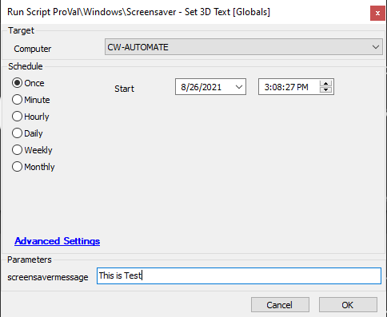

## Summary

This script will set custom text as a screensaver on a Windows machine.

**Time Saved by Automation:** 15 Minutes

## Sample Run

#### Global Parameters

| Name                      | Example | Required | Description                                                                                                         |
|---------------------------|---------|----------|---------------------------------------------------------------------------------------------------------------------|
| TimeoutSeconds            | 300     | True     | The value is in seconds. This sets the screensaver timeout based on user inactivity for the provided time.        |
| PromptForLogin            | 1       | True     | This enables/disables whether the user is required to log in again once the screensaver is activated due to inactivity. 1 - Enable, 2 - Disable |
| scriptengineenablelogger   | 1       | False    | This ensures the complete script log is printed for auditing purposes.                                             |

#### User Parameters

| Name               | Example      | Required | Description                                             |
|--------------------|--------------|----------|---------------------------------------------------------|
| screensavermessage | This is Test | True     | This message will be displayed on the screen when the screensaver is activated. |

## Process

This script creates a scheduled task that will enable the screensaver after the specified seconds of inactivity for all users. The screensaver settings will be applied at the next logon of each user.

Please ensure that the message for the `@screensavermessage@` parameter does not exceed 20 characters (including letters, numbers, spaces, and special characters). If it exceeds 20 characters, the script will fail to set the message due to Windows limitations.

## Output

- Script log
