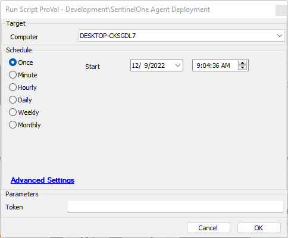
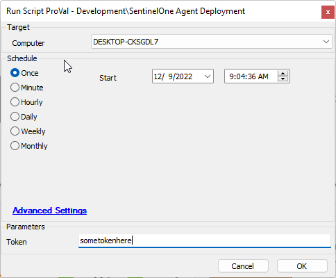
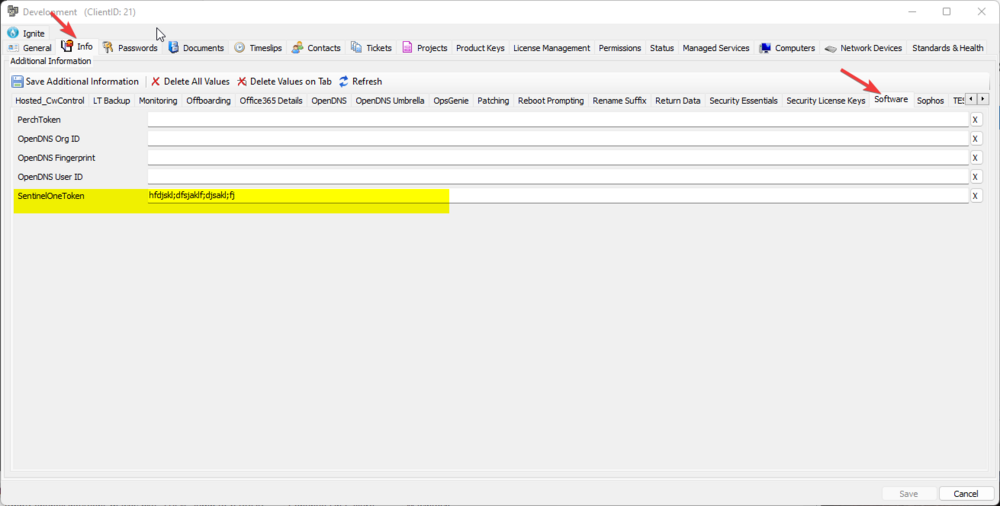
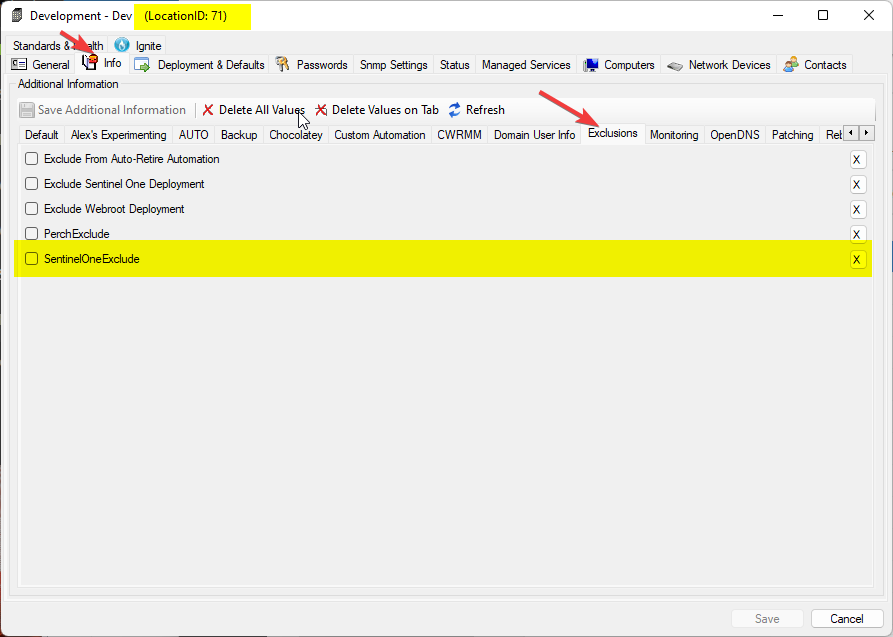
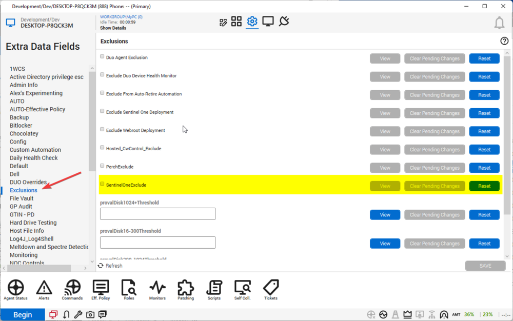

## Summary

This document describes how to deploy the SentinelOne agent with an agent token set at either the Global, Client, or Script level.

## Sample Run

- Running in this manner without a token will result in the script attempting to use the client-level token `edf` value. If this is not set, it will grab the System property token value to process the request.

- Adding a token to the Token parameter will override all client-level tokens and global property tokens, using the provided token as the means to process the request.

## Dependencies

- The following links must remain valid or be updated to reflect any changes in this download made by Connectwise:
  - [SentinelOneAgent-Windows_64bit.msi](https://cwa.connectwise.com/tools/sentinelone/SentinelOneAgent-Windows_64bit.msi)
  - [SentinelOneAgent-Windows_32bit.msi](https://cwa.connectwise.com/tools/sentinelone/SentinelOneAgent-Windows_32bit.msi)

## Implementation

### Global Parameter Set Instructions:

1. Sync the following script: [CWM - Automate - Script - Property - Set](/docs/2b64bf00-b8b2-499b-b9d2-70d218f18cfb).
2. Run [CWM - Automate - Script - Property - Set](/docs/2b64bf00-b8b2-499b-b9d2-70d218f18cfb) with the following parameters:
   - Name: SentinelOneDefaultToken
   - Type: Global
   - Value: [Your Default SentinelOne Token]
   - Overwrite can be left blank or changed to 1 if you believe you may already have a SentinelOneDefaultToken global parameter.
3. Sync and run this script.

### Client Level Tokens

Client level tokens can be set in the following client `edf` location:

### Exclusions

Exclusions can be set in the following locations:

## Variables

| Name           | Description                                                                                           |
|----------------|-------------------------------------------------------------------------------------------------------|
| S1SiteToken    | Variable holder for a site token from either the client level `edf` or the system property.          |
| ComputerExclude| Variable holder to check for a computer-level exclusion to the installation.                         |
| LocationExclude| Variable holder to check for a location-level exclusion to the installation.                         |

### User Parameters

| Name   | Example          | Required | Description                                                                                 |
|--------|------------------|----------|---------------------------------------------------------------------------------------------|
| Token  | Sometokenhere    | False    | Use this parameter to bypass Client `edf` tokens and global property tokens for this installation. |

## Process

1. Ensure the software is not already installed; exit if it is.
2. Determine the necessary token:
   1. Check the client-level `edf` first; this takes precedence over the global set parameter.
   2. If a client-level `edf` is not set, get the global set parameter.
   3. If that is not set, then exit with an error.
3. Check for any computer-level exclusion; if one exists, exit with an error.
4. Check for any location-level exclusion; if one exists, exit with an error.
5. Download the installer to the `C:/Windows/ltsvc/SentinelOne` folder.
6. Verify the download; if not downloaded, exit with an error.
7. Install SentinelOne.
8. Verify installation success; if not successful, then exit with an error.

## Output

- Script log

