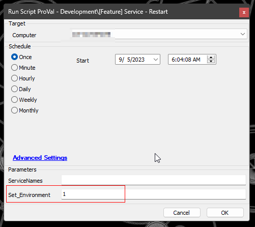
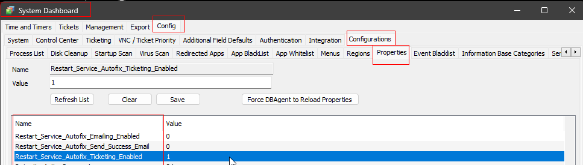
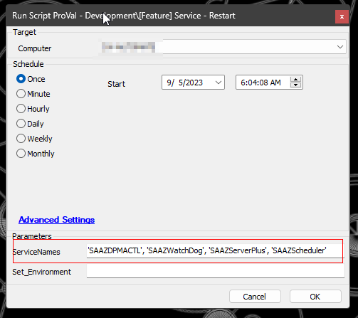
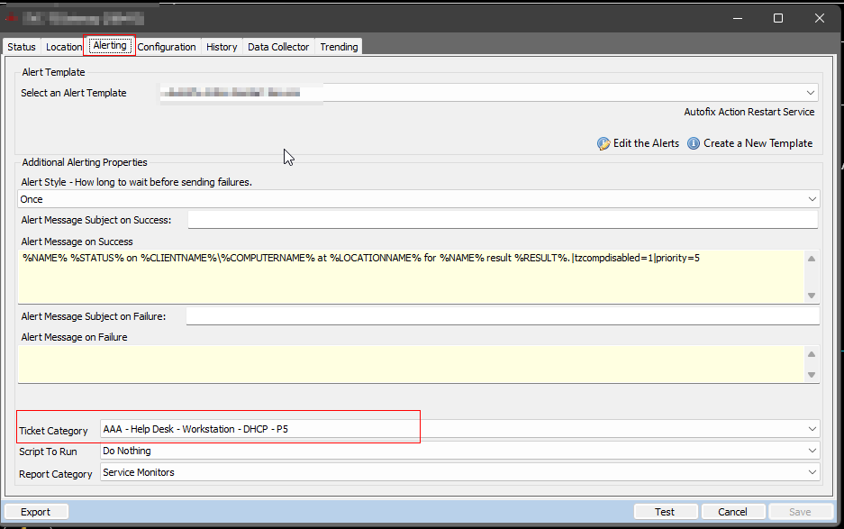
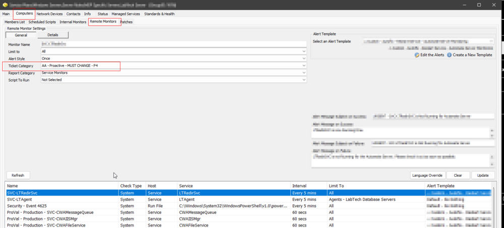

## Summary

This script will restart one or more services with proper error handling. It can also be imported and triggered using the Alert Template '△ Custom - Autofix - Restart Service'.

## Implementation

These steps must be followed after importing/updating the script after September 5, 2023.

**Step 1:** Run the script on any online Windows computer. This will create the necessary system properties.

System Properties:

**Step 2:** Set the system properties for alerting. Check the **`System Properties`** section of the document for more information on the properties.

## Sample Run

**Manual Execution:**

## Dependencies

- [EPM - Windows Configuration - Agnostic - Invoke-RestartService](<../../powershell/Invoke-RestartService.md>)

### Variables

| Name                     | Description                                                       |
|--------------------------|-------------------------------------------------------------------|
| STATUS                   | Status returned from Monitor Set (SUCCESS|FAILED)                |
| FieldName                | Service name returned from Monitor Set                             |
| Subject                  | Ticket/Email subject                                              |
| Body                     | Ticket/Email body for failure                                      |
| Comment                  | Ticket/Email comment for failure                                   |
| TicketComment            | Ticket comment for success                                         |
| EmailBody                | Email body for success                                            |
| TicketCreationCategory    | Numerical ID of the ticket category to create the ticket. The script will fetch the ticket category from the monitor set running it. |
| PSCheck                  | To check the PowerShell version of the computer, the script will perform Automate's inbuilt functions to attempt to restart the service for older operating systems. |

## User Parameters

| Name              | Example                                                      | Required                     | Description                                          |
|-------------------|--------------------------------------------------------------|-------------------------------|------------------------------------------------------|
| ServiceNames      | 'SAAZDPMACTL', 'SAAZWatchDog', 'SAAZServerPlus', 'SAAZScheduler' | True (for manual execution)   | A string array of service names to restart.          |
| Set_Environment    | 1                                                            | True (for first run)         | Set it to 1 to create the required system properties. |

## System Properties

| Name                                           | Example | Required                | Description                                                                                       |
|------------------------------------------------|---------|-------------------------|---------------------------------------------------------------------------------------------------|
| Restart_Service_Autofix_Ticketing_Enabled     | 1       | True                    | 1 and 0 to toggle between the ticket creation feature of the script. The default value is 1 (Enabled Ticketing). |
| Restart_Service_Autofix_Emailing_Enabled      | 0       | False                   | 1 and 0 to toggle between the emailing feature of the script. The default value is 0 (Disabled Emailing). |
| Restart_Service_Autofix_Send_Success_Email     | 0       | False                   | Set it to 1 to send an email on monitor success as well. The default value is 0. To enable monitor success emails, `Restart_Service_Autofix_Emailing_Enabled` must be set to 1. |
| _sysTicketDefaultEmail                          | [support@provaltech.com](mailto:support@provaltech.com) | True (if emailing is enabled) | Email address to notify. It is mandatory to set the email address(es) if the system property `Restart_Service_Autofix_Emailing_Enabled` is set to 1. Multiple email addresses should be separated by a semicolon. **Note: Please be careful while making any changes to this property as this is a default system property and other script(s) might be using this as well. Do not update the email address(es) saved in this property without checking the other scripts for this system property.** |

## Ticket Category

The script will fetch the ticket category from the monitor set running the script.

From individual machine:  

From Group Monitor:  

## Output

- Script log (for detailed information on individual results)
- Tickets (if enabled)
- Emails (if enabled)

