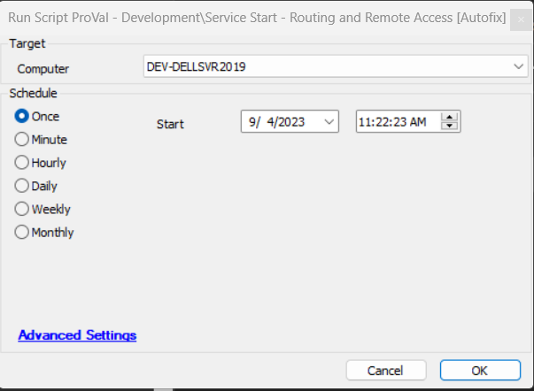

## Summary

This will set the startup type to Automatic and will restart the RemoteAccess service on endpoints.

Alert Template -  ~Autofix - Set RemoteAccess Startup Type to Auto

This should be called by the monitor [CWM - Automate -Remote Monitor - ProVal - Development - RemoteAccess Service - Set StartType To Auto](<../monitors/RemoteAccess Service Check.md>)

## Sample Run

## Output

Startup Type = Automatic  
Status = Running

