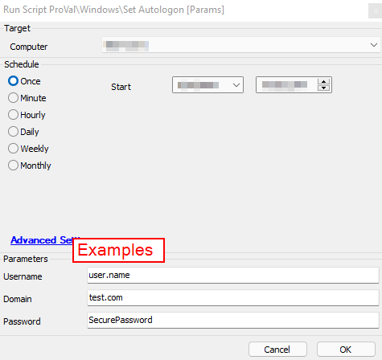

## Summary

This script will download the Autologon.exe from the sysinternals website and will pass the AutoLogon.exe parameters that will allow a user to login automatically after the system is rebooted.

Time Saved by Automation: 15 Minutes

## Sample Run

## Dependencies

This script downloads a file from the Microsoft Sysinternals website. If this link changes the script must be updated to reflect the proper download location.

#### User Parameters

| Name     | Example           | Required | Description                                                                                      |
|----------|-------------------|----------|--------------------------------------------------------------------------------------------------|
| Username | user.name         | True     | The username of the user for Autologon on the target device.                                   |
| Domain   | test.com          | False    | The name of the domain. (Leave blank for a local user account.)                                |
| Password | SecurePassword1    | True     | The password for the user for Autologon on the target device.                                   |

## Process

This script will download the Autologon.exe from Microsoft to the LTSvc folder. It will then execute the Autologon.exe application passing the parameters entered by the user running the script. The script will then lock the machine forcing the Autologon to go into effect.

## Output

- Script log messages

