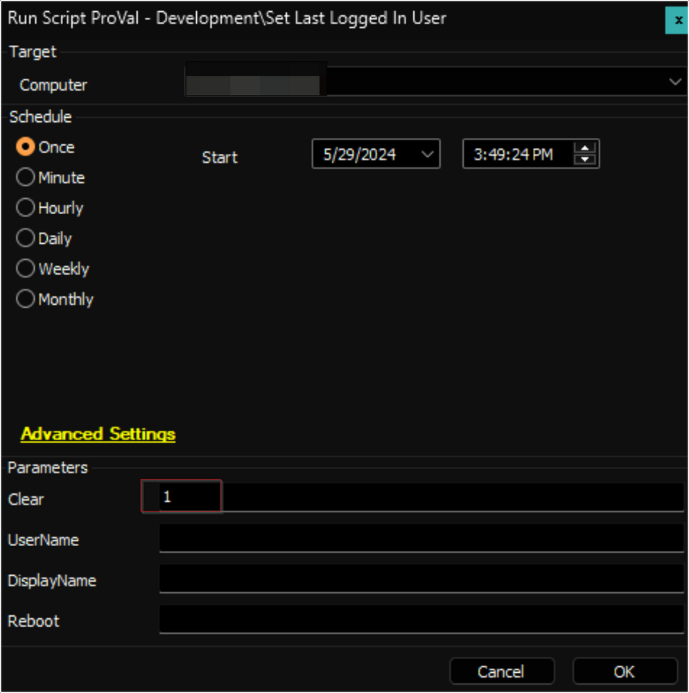
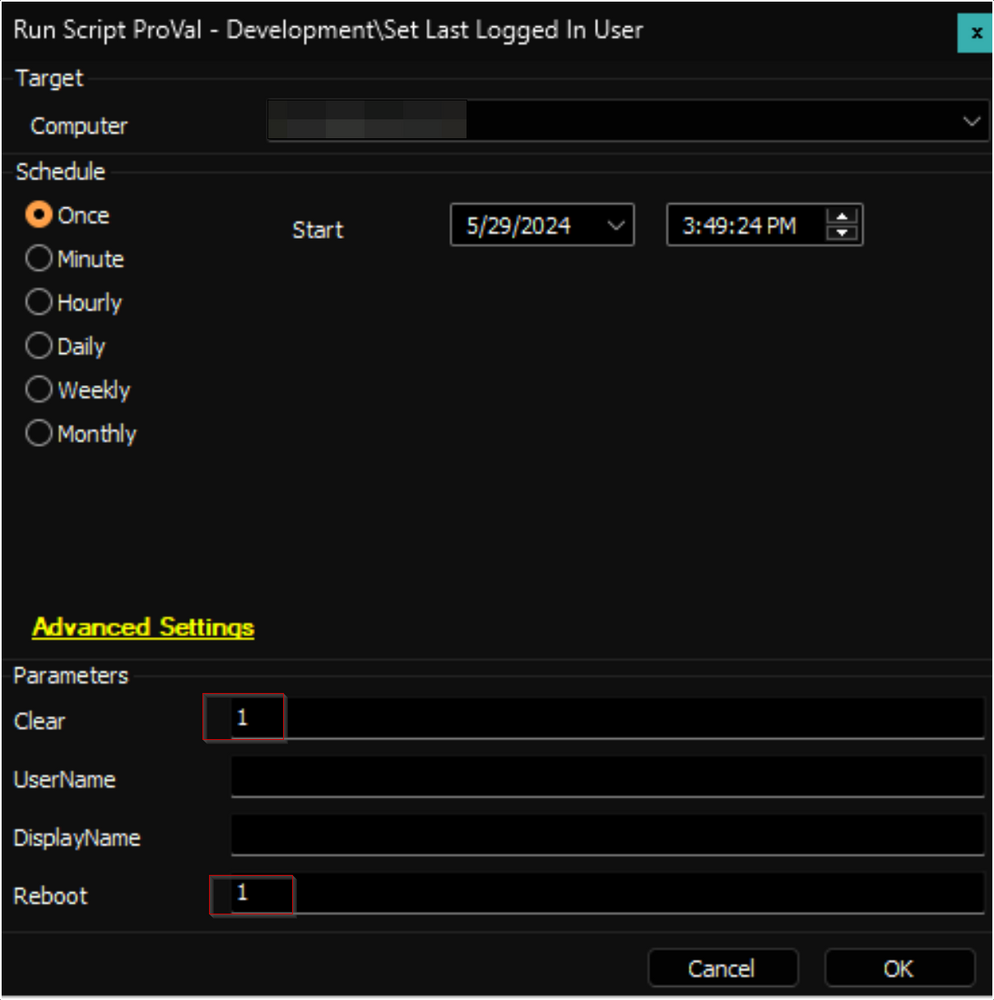
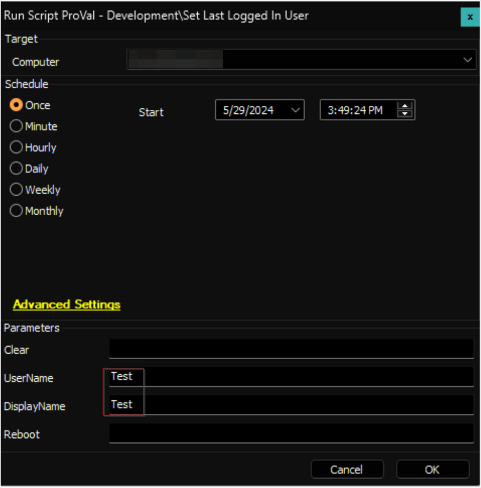
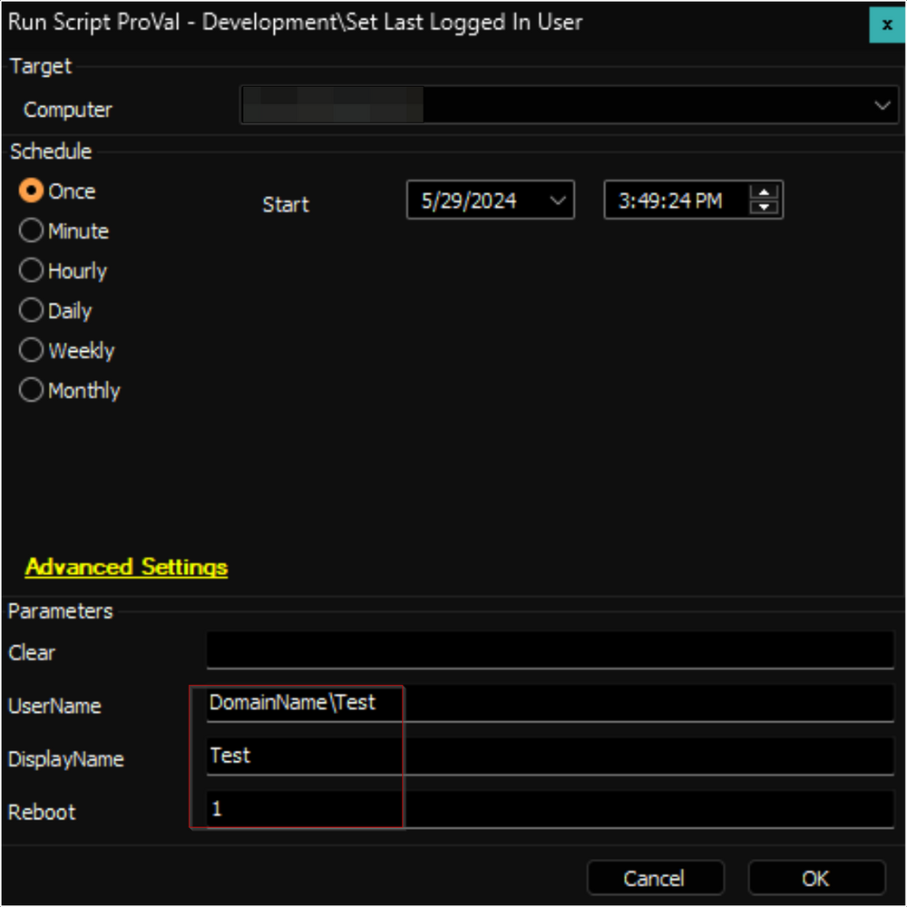

## Summary

This is an Automate implementation of the agnostic script [Set-LastLoggedOnUser](https://proval.itglue.com/DOC-5078775-16017466) to manage the last logged-in user's information displayed on the Windows login screen.

**Notes:**
- The user must have logged on to the computer at least once to be set at the login screen by this script.
- It is mandatory to restart the computer to implement changes. `Reboot` parameter can be used to forcefully restart the computer.
  - You can circumvent the need to reboot the machine if you are logged in while the script is running. Once you log out, the changes will be applied.

## Sample Run

- Clears the last logged-in user's information from the login screen. The computer must be restarted manually afterwards to implement the changes.
  
  

- Clears the last logged-in user's information from the login screen and forcefully restarts the computer.
  
  

- Sets the specified local user as the last logged-in user. The computer must be restarted manually afterwards to implement the changes.
  
  

- Sets the specified domain user as the last logged-in user and forcefully restarts the computer.
  
  

## Variables

| Name             | Description                                         |
|------------------|-----------------------------------------------------|
| ProjectName      | Set-LastLoggedOnUser                               |
| WorkingDirectory  | C:/ProgramData/_Automation/Script/Set-LastLoggedOnUser |

#### User Parameters

| Name         | Example              | Required | Description                                                                                     |
|--------------|----------------------|----------|-------------------------------------------------------------------------------------------------|
| Clear        | 1                    | True     | Clears the last logged-in user's information from the login screen.                           |
| UserName     | Domain/UserName      | True     | Sets the specified username as the last logged-in user. The username should be in the format 'Domain/User' or 'User'. |
| DisplayName  | User Name            | False    | Optionally specifies the display name to set for the last logged-in user. If not provided, it defaults to the username. |
| Reboot       | 1                    | False    | Optionally restarts the computer to apply the changes immediately.                             |

## Output

- Script log

