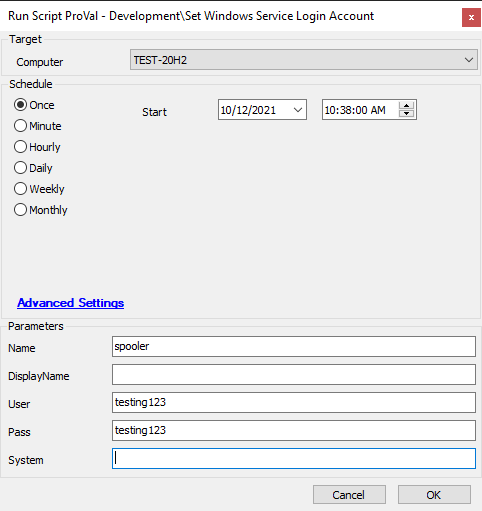
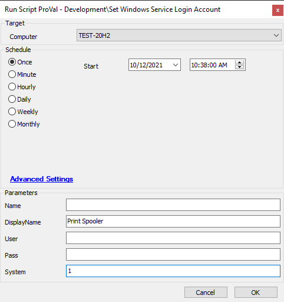

## Summary

This document is used to change the service login account for a target service.

## Sample Run

## Dependencies

- [EPM - Windows Configuration - Agnostic - Set-ServiceLogin](https://proval.itglue.com/DOC-5078775-8438992)

## Variables

`@ParameterMode@` - Variable used to modify script parameters based on the User Parameters.

#### User Parameters

| Name         | Example       | Required      | Description                                                                                              |
|--------------|---------------|---------------|----------------------------------------------------------------------------------------------------------|
| Name         | spooler       | Semi-Required | The service name to modify. Either this or the DisplayName parameter must be specified.                 |
| DisplayName  | Print Spooler | Semi-Required | The display name of the service to modify. Either this or the Name parameter must be specified.         |
| User         | testuser      | Semi-Required | The username of the user to run the service as. User and Pass must be specified; otherwise, System must be specified. |
| Pass         | testpass123   | Semi-Required | The password of the user to run the service as. User and Pass must be specified; otherwise, System must be specified. |
| System       | 1             | Semi-Required | Use this to run the service as "Local System." System must be specified; otherwise, User and Pass must be specified. |

## Process

See [EPM - Windows Configuration - Agnostic - Set-ServiceLogin](https://proval.itglue.com/DOC-5078775-8438992) for process information.

## Output

- Script log
- Script state
- Local files on the computer
  - `.//Set-ServiceLogin-log.txt`
  - `.//Set-ServiceLogin-data.txt`
  - `.//Set-ServiceLogin-error.txt`

