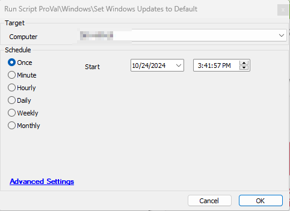

## Summary

This script removes any registry entries that may be preventing Windows updates and restores the default Windows Update settings, fully re-enabling updates for the user.

## Sample Run

## Output

- Script log

