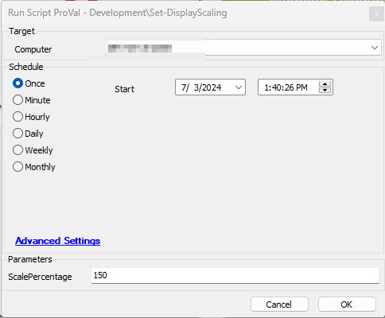

## Summary

This script sets custom display scaling on existing as well as new users for Windows machines.

## Sample Run

## Dependencies

[Agnostic - Set-DisplayScaling](<../../unsorted/Agnostic - Set-DisplayScaling.md>)

## User Parameters

| Name            | Example | Required | Description                                                                                                                                                          |
|-----------------|---------|----------|----------------------------------------------------------------------------------------------------------------------------------------------------------------------|
| ScalePercentage  | 150     | True     | Enter one of the scaling percentages from the options below:                                                                                                        |
|                 |         |          | - 100 - to maximize the window zoom to 100%                                                                                                                     |
|                 |         |          | - 125 - to maximize the window zoom to 125%                                                                                                                     |
|                 |         |          | - 150 - to maximize the window zoom to 150%                                                                                                                     |
|                 |         |          | - 175 - to maximize the window zoom to 175%                                                                                                                     |
|                 |         |          | - 200 - to maximize the window zoom to 200%                                                                                                                     |

## Output

- Script log

