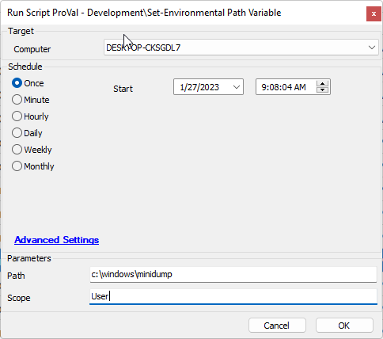
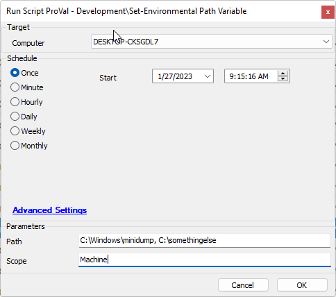

## Summary

Will add a requested windows path to the environmental path variable for the desired scope.

## Sample Run

- Setting a User scoped path variable

- Setting more than one machine scoped path variables.

**NOTE:**  Scope is not mandatory and if left blank the scope will default to the machine scoped variable.

## Dependencies

- [EPM - Windows Configuration - Agnostic - Set-PathVariable](https://proval.itglue.com/DOC-5078775-11976265)

## Variables

Standard agnostic template variables apply.

#### User Parameters

| Name  | Example                   | Required | Description                                                                                     |
|-------|---------------------------|----------|-------------------------------------------------------------------------------------------------|
| Path  | C:/windows, C:/temp...   | True     | The paths that must exist in the scoped environmental path variable.                           |
| Scope | UserMachine           | False    | The scope of the environmental path variable you wish to target.This is defaulted to 'Machine' |

## Process

Please reference [EPM - Windows Configuration - Agnostic - Set-PathVariable](https://proval.itglue.com/DOC-5078775-11976265) for process information.

## Output

- Script log

