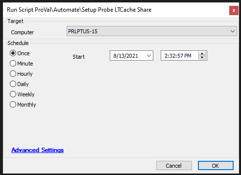

## Summary

This script will remove the current LTCache on the Probe for the target location, create credentials (if they don't exist), and establish a new LTCache on the Probe.

It will then set the location settings to use the new LTCache settings.

**Time Saved by Automation:** 10 Minutes

## Sample Run

## Dependencies

The location must have a probe enabled; otherwise, the script will exit with an error.

## Variables

- `@TargetComputerID@` - Computer on which the script is running
- `@Computerid@` - Probe computer ID
- `@DiskSpaceCheck@` - Result in percentage of free space available on the drive
- `@ProbeHostName@` - Computer name of Probe ID
- `@LTCachePath@` - `@ProbeHostName@/LTCache`
- `@LTCachePassword@` - Randomly generated password stored in the passwords table

## Process

- Find Probe Agent
- Check the current computer drive's free space; if less than 20%, the script will exit
- Create folder and share
- Create a local account username/password for the LTCache folder
  - Username: ltcache
  - Password: Randomized / Stored in Passwords Table / Client Passwords

## Output

Script log

