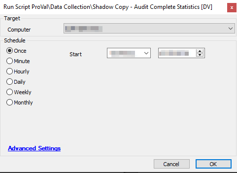

## Summary

This script records data related to Shadow Copy for individual systems into a [Custom Table - plugin_proval_shadowcopystats](https://proval.itglue.com/DOC-5078775-8157668).

Note: Get the below MD5 file hash whitelisted for the script to work in the environment where threatlocker or any blocking application is installed.  
MD5 FileHash: `E69A5AD2CDCF7B20C7205D4A7BEC08C4`  

Time Saved by Automation: 5 Minutes

## Sample Run

## Dependencies

- [Dataview - Windows - Shadow Copy State [Script]](https://proval.itglue.com/DOC-5078775-8105265)  
- [Custom Table - plugin_proval_shadowcopystats](https://proval.itglue.com/DOC-5078775-8157668)

## System Property

| Name                              | Example | Required | Default | Description                                                                                                                                                                   |
|-----------------------------------|---------|----------|---------|-------------------------------------------------------------------------------------------------------------------------------------------------------------------------------|
| Proval_ShadowCopyMaxAgeInDays     | 10      | True     | 10      | It is required to set so that the [Monitor - Missing Recent ShadowCopy [Autofix]](https://proval.itglue.com/DOC-5078775-8057145) can trigger this script to run as autofix to collect latest data. |

## Process

This script will first verify that the target system is a Windows-based device, or it will exit the script.

The script will verify that the [Custom Table - plugin_proval_shadowcopystats](https://proval.itglue.com/DOC-5078775-8157668) custom table has been created, if it does not exist in the DB it will create it. 

The script will then ensure that the data for the target machine is removed so it can be updated.

The script will then run the PowerShell script. This PowerShell script will gather all of the necessary data/stats about Shadow Copy on this system. The PowerShell will also generate the "INSERT INTO" statement used to insert the data into the custom table. If the PowerShell script returns "No Shadow Copy Found" it will exit the script without modifying the custom table.

The script will run the SQL statement above against the Automate server to insert the data into the database.

## Output

- Script logs.
- Custom table [Custom Table - plugin_proval_shadowcopystats](https://proval.itglue.com/DOC-5078775-8157668).
- Dataview [Dataview - Windows - Shadow Copy State [Script]](https://proval.itglue.com/DOC-5078775-8105265).

