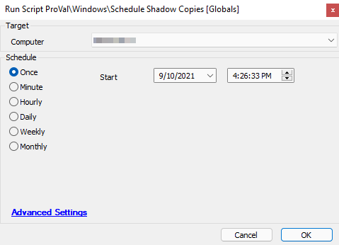

## Summary

The script uses PowerShell to enable shadow copies (similar to the older "previous versions" feature in Windows 7). It will create a Shadow Copy task for the system drive via Task Scheduler at the scheduled times defined in the global parameters.

**Time Saved by Automation:** 20 Minutes

## Sample Run

## Dependencies

None

## Variables

`@ShadowCopies@` - The output from the PowerShell used to build the Shadow Copy configuration.

#### Global Parameters

| Name         | Example  | Required | Description                                                                                         |
|--------------|----------|----------|-----------------------------------------------------------------------------------------------------|
| AM-Time      | 6:00 AM  | True     | This is the scheduled AM instance of the Shadow Copy (6:00 AM is the default value)                |
| PM-Time      | 6:00 PM  | True     | This is the scheduled PM instance of the Shadow Copy (6:00 PM is the default value)                |
| Task-Prefix  | MSP-     | True     | The prefix added to the name of the scheduled task (MSP- is the default value)                    |

## Process

Once the global parameters are configured to the desired values, the script will use those values to run a PowerShell script that allocates space on the system drive for the shadow copies. It then proceeds to set up scheduled tasks for both AM and PM shadow copies. The script will verify that there were no failures in the PowerShell script and will exit successfully as long as there are no errors returned from the PowerShell script. If the PowerShell script does not run successfully, the automation script will exit with an error and log a message.

## Output

Script log

