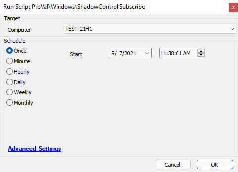

## Summary

This document describes how to download and install the ShadowControl client on the target machine. It automatically subscribes the installed client to the **ProVal ShadowControl** server and deletes the downloaded installer upon completion.

**Note:** This script is hardcoded to subscribe to the ProVal Shadow Control server. Please do not use this script if you are attempting to subscribe a machine to a different instance.

**Time Saved by Automation:** 5 Minutes

## Sample Run

## Dependencies

The agent will need the appropriate Storage Craft applications installed so that it can subscribe to the ProVal Shadow Control instance.

## Variables

- `%ShellResult%` - The result from the attempted Shadow Control signup.

## Process

The script will run a command-line argument against the `stccmd` application on the endpoint, which will have the target endpoint subscribe to the ProVal Shadow Control portal.

## Output

Script log messages only.

