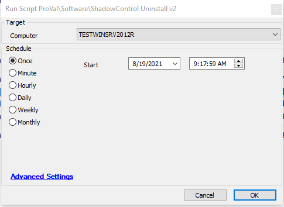

## Summary

This script will fetch the uninstall string from the DB and attempt to uninstall ShadowControl and unregister it from the server.

Time Saved by Automation: # Minutes

## Sample Run

## Variables

- `@UninstallPath@` - Shows the uninstall path fetched from the database
- `@NewUninstallPath@` - Shows the new uninstall path after using the replace function

## Process

- Runs a shell command to unregister the agent from the server
- Fetch the uninstall path from the DB
- Uses the replace function to create the new uninstall path
- Uses that path for uninstalling the agent

## Output

- Script log

