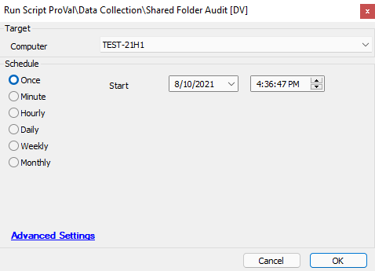

## Summary

This script collects information about shared folder details such as Share Name, Shared Path, Shared Type, Users having access to the shared folder, Permission Type (Allow or Deny), and Permission Rights (Full, Read, Change, or No Access).

**Time Saved by Automation:** 10 Minutes

## Sample Run

## Dependencies

[Shared Folder Audit](https://proval.itglue.com/DOC-5078775-7978131)

## Variables

- `@PowerShellout@` - The results from the PowerShell script
- `@LoopCounter@` - Used to loop through the data based on how much data is returned in the script
- `@NameLoop@` - The name of the share
- `@ResourceLoop@` - The resource information about the share
- `@RemarkLoop@` - The remark information about the share
- `@AccountNameLoop@` - The AccountName information about the share
- `@AccessControlType@` - The Access Control Type information about the share
- `@AccessRight@` - The Access Right information about the share
- `@Check@` - Used to check the loop counter

#### Script States

| Name                      | Example                                           | Description                                                                                     |
|---------------------------|---------------------------------------------------|-------------------------------------------------------------------------------------------------|
| ShareFolder@loopcounter@ | Example -- Resource -- Remark -- AccountName -- AccessControlType -- AccessRight | This is a concatenated string of the values above and is used to display the data in the associated Dataview |

## Process

The script will run a PowerShell script to gather data from the endpoint. It will then use a specially designed SQL loop to separate the results from the PowerShell run into different script state lines. Once the loop encounters a bad value, the script will stop the loop and finish processing the script states for the machine.

## Output

- Script States to be displayed in a Dataview
- Script Log Messages

