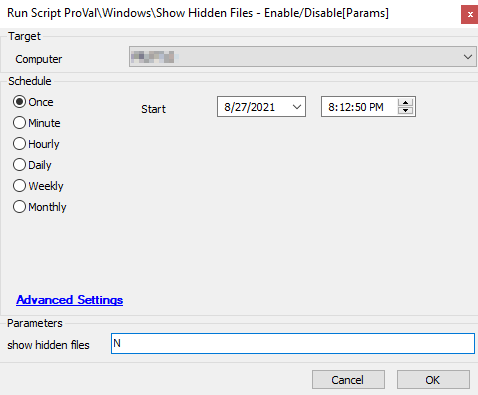

## Summary

The script will hide/unhide the hidden files based on the input parameter.

Time Saved by Automation: 2 Minutes

## Sample Run

## Variables

#### User Parameters

| Name                  | Example | Required | Description                                          |
|-----------------------|---------|----------|------------------------------------------------------|
| Show hidden files     | N       | False    | Any text in here will display hidden files.         |

## Process

- The script checks the input in the user parameter "Show hidden files".
- If there is no input, it runs a PowerShell script and hides the hidden files.
- If there is any text in the user parameter, it will unhide the hidden files by running the PowerShell script.

## Output

- Script log

