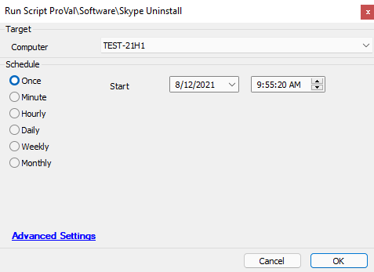

## Summary

This script will attempt to uninstall Skype.

**Time Saved by Automation:** 10 Minutes

## Sample Run

## Dependencies

None.

## Process

The script will verify that Skype is installed. If Skype is installed, it will fetch the proper uninstall string from the device, sanitize the string, and then run the uninstall string. The script will then refresh its software inventory and verify if the application was removed successfully.

If Skype is removed successfully, the script will exit with a successful log message. If Skype is not removed, the script will exit with an error and an error log message.

## Output

Script log messages.

