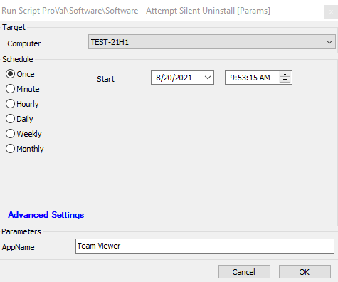

## Summary

This script will fetch the uninstallation string from the database for the defined app in the parameter `@AppName@` and then attempt to uninstall the application.  
**Time Saved by Automation:** 10 Minutes

## Sample Run

#### User Parameters

| Name     | Example      | Required | Description                               |
|----------|--------------|----------|-------------------------------------------|
| AppName  | Team Viewer  | True     | Application name that needs to be uninstalled |

## Process

When the script runs, it will ask for a parameter `AppName`, which needs to be filled by the user. This script will then check if the software is installed on the machine. If it is, the script will fetch the uninstallation string from the database for the defined app in the parameter `@AppName@` and attempt to uninstall the application. The script also verifies whether the software was uninstalled successfully and displays the result in the script's logs section.

## Output

- Script log
