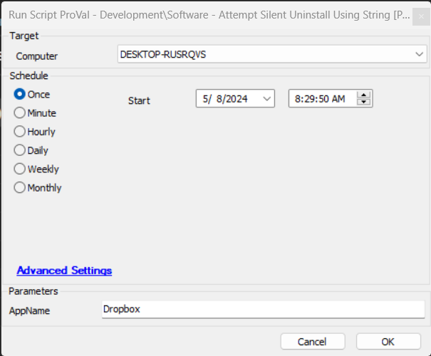

## Summary

This script will fetch the uninstallation string from the database for the defined app in the parameter `@AppName@` and then attempt to uninstall the application. And if `uninstall.exe` is found in the uninstall string, it attempts to uninstall the application using silent switches.

**Time Saved by Automation:** 10 Minutes

## Sample Run

### User Parameters

| Name     | Example  | Required | Description                                   |
|----------|----------|----------|-----------------------------------------------|
| AppName  | Dropbox  | True     | Application name that needs to be uninstalled |

## Process

When the script runs, it will ask for a parameter `AppName` that needs to be filled by the user. This script will then look if the software is installed on the machine and if yes, it will fetch the uninstallation string from the database for the defined app in the parameter `@AppName@` and then attempt to uninstall the application. And if `uninstall.exe` is found in the uninstall string, it attempts to uninstall the application using silent switches. This script also verifies if the software was uninstalled or not and displays the result in the script's logs section.

## Output

- Script log

