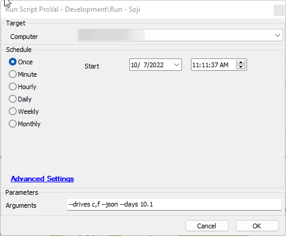

## Summary

This is an Automate script intended to execute the Soji application found in the GitHub repository.

## Sample Run

Please Reference the Soji documentation for Argument options.

## Dependencies

- [Soji](https://proval.itglue.com/DOC-5078775-10338558)

### User Parameters

| Name      | Example                | Required | Description                                                                 |
|-----------|------------------------|----------|-----------------------------------------------------------------------------|
| Arguments | --drives c,f --json    | False    | Please reference [Soji](https://proval.itglue.com/DOC-5078775-10338558) for argument usage. |

## Process

1. Installs .NET 6 (if not installed)
2. Set up the environment and download Soji
3. Run Soji with the passed-in arguments
4. Compress the logs files as `SojiLogs.Zip` and upload them to Automate server.

## Output

- Script log
- Desired file output to the soji directory ie. json etc.
- On Labtech server: `%LTShare%/Uploads/%ClientName%/%ComputerName% - %Computerid%/SojiLogs.zip`

