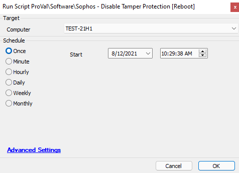

## Summary

This script will reboot a machine into safe mode and change the registry keys related to tamper protection for machines with Sophos Tamper Protection enabled.

**Time Saved by Automation:** 20 Minutes

## Sample Run

## Dependencies

- The target machine must have Sophos installed.
- The target machine must be running a Windows operating system.

## Variables

- `@Result@` - Used to verify if the tamper protection was disabled properly.

## Process

The script will first verify that the target device has Sophos installed. It will then reboot the machine into safe mode and wait for the machine to come back up. The script will stop the Sophos services and change the appropriate registry keys to disable tamper protection. After that, it will restart the Sophos services and reboot the machine back to normal mode. Finally, the script will verify that tamper protection was properly disabled; if successful, it will exit with a success log message. If the script fails, it will exit with an error log message.

## Output

Script log messages only.

