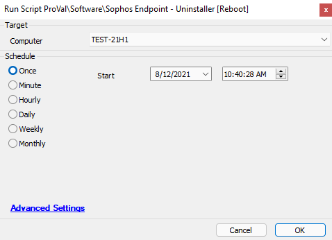

## Summary

This script will attempt to uninstall Sophos endpoint on the target device.

**NOTE:** This script will force a reboot, please keep this in mind when running the script.

Time Saved by Automation: 15 Minutes

## Sample Run

## Dependencies

This will only work for a Windows-based target.

The machine must have Sophos installed and Sophos Tamper Protection must be disabled.

**NOTE:** The script will verify if Sophos Tamper Protection is enabled/disabled. If you need to disable tamper protection, please check the [Sophos - Disable Tamper Protection](https://proval.itglue.com/DOC-5078775-8058691) script.

## Variables

`@Result@` - The result from the PowerShell that checks the status of Sophos Tamper Protection on the target machine.

## Process

The script will verify that the target device is a Windows-based machine. It will exit if the OS is not Windows.  
Will verify if the Sophos service is running. It will exit if Sophos is not running/installed.  
Will verify if Tamper Protection is enabled/disabled. If Tamper Protection is enabled, the script will exit with a log message and error.  
If Tamper Protection is disabled, the script will then run the uninstall strings provided by Sophos.  
**Once the uninstall command completes, the script will issue a reboot to the machine.**  
Once the machine is back online, the script will update the service inventory and check if the Sophos services are present.  
If the services are present, then the script failed and will exit with a log message and will exit with an error.  
If the services are no longer present, then the script was successful and will exit with a success message.

## Output

- Script log messages only

