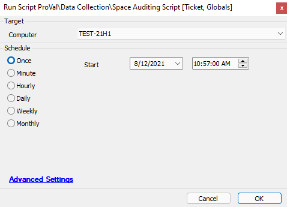
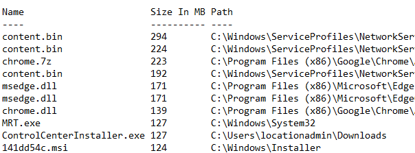

## Summary

This script scans your main drive (C: for Windows and everything for Linux) and outputs the information to a text file in the temp folders. It also includes the information inside the ticket and attaches the text file in case it becomes unreadable in the ticket.

**Time Saved by Automation:** 10 Minutes

## Sample Run

## Dependencies

- Windows or Linux-based machines

## Variables

`@SpaceAuditOutput@` - The output of the log file containing the data from the audit

#### Global Parameters

| Name                     | Example | Required | Description                                                                                                         |
|--------------------------|---------|----------|---------------------------------------------------------------------------------------------------------------------|
| TicketCreationCategory    | 5       | False    | The category used when creating the ticket. Setting this category may help route the ticket to the appropriate location in the PSA. |

## Process

The script will first check to see if a previous version of the log file exists from a prior run of this script. If the file exists, it will delete the file and continue. If the file does not exist, the script will proceed.

The script will then determine if the machine is running a Windows OS or a Non-Windows OS.

For Non-Windows OS, the script will run a BASH command to gather the data and output the results to a text file.

The script will gather the information from the text file and generate a ticket, attempting to place all of the data from the earlier BASH command into the ticket. It will also attempt to download the log file and attach it to the ticket in case the results were too long for Automate to hold in a variable.

For Windows OS, the script will run a PowerShell script and output the data to a text file.

The script will then gather the information from the text file, generate a ticket, and attempt to place all of the data from the earlier PowerShell command into the ticket. It will also attempt to download the log file and attach it to the ticket in case the results were too long for Automate to hold in a variable.

If the ticket is successfully created with the data, the script will exit with a success log message.

If the script fails to gather the data appropriately, it will exit with an error log message.

## Output

- Script log messages
- Ticket
- Log file output to the target device.

## Example Output

