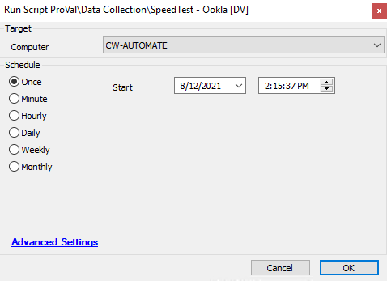

## Summary

This script will gather an internet speed test record from Ookla.  
Time Saved by Automation: 15 Minutes

## Sample Run

## Dependencies

[Speedtest Record (Script)](https://proval.itglue.com/DOC-5078775-8023156)

## Variables

| Variable | Description |
|----------|-------------|
| Ookla    | This variable contains information about whether ookla package downloaded and extracted properly |
| Speedtest| This variable contains information of the ookla speedtest executable file output |

#### Script States

| Name         | Example                                                                                  | Description                     |
|--------------|------------------------------------------------------------------------------------------|---------------------------------|
| SpeedTestCLI | @ServerName@ -- @ServerId@ -- @Latency@ -- @Jitter@ -- @PacketLoss@ -- @Download@ -- @Upload@ -- @Downloadbytes@ -- @Uploadbytes@ -- @ExecuteDate@ -- @ShareURL@ | This stores all speedtest output |

## Process

This script will download the speed test zip file from Ookla and extract it. After extraction, it executes it and stores the output to a script state.

## Output

- Script log
- Script state
- Dataview

