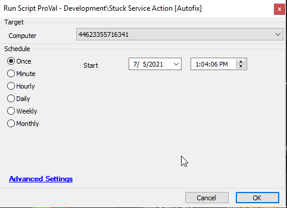

## Summary

This script will detect any service stuck in a state other than Running or Stopped and try to stop that process forcefully.

Time Saved by Automation: 10 Minutes

## Sample Run

## Dependencies

[Stuck Service Detection](https://proval.itglue.com/DOC-5078775-7819333)

## Variables

| Variable | Description                                                   |
|----------|---------------------------------------------------------------|
| Output   | It contains PowerShell output of stuck commands and its action |

### Global Parameters

| Name    | Example | Required | Description                                           |
|---------|---------|----------|-------------------------------------------------------|
| Action  | 0       | True     | 0 - No start of service1 - Attempt to start the stuck service |

### Script States

| Name            | Example   | Description          |
|----------------|-----------|----------------------|
| StoppingService | Ticket_ID | It contains ticket record |

## Process

- This script checks for a service in a status other than Running or Stopped.
- If found, then it will attempt to stop the service forcefully.
- The script depends on the Global parameter "Action". If it is set to 0, then the stuck service will only be stopped. If set to 1, it will attempt to start the stuck service.
- If the action failed to stop or start the service depending upon the option, then it will create the ticket.

## Output

- Script log
- Script state
- Ticket

