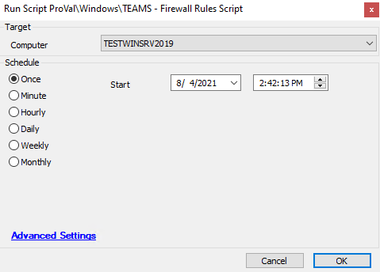

## Summary

### **This script needs revision.**

This script executes the PowerShell which set rules on teams for all users other than Public and 'ADMINI~*'. Rulename is “Teams.exe for user (username)”.

Time Saved by Automation: 5 Minutes

## Sample Run

## Dependencies

- Windows OS and PowerShell version greater equal to 3.

## Variables

- `@Result@` -> Result of the PowerShell to add the firewall rule
- `@shellresult@` -> results of checking the PowerShell version on the machine

## Process

1. Checks the PowerShell version on the machine for v3.0 or greater
2. Runs PowerShell to add the firewall rule for Teams
3. Logs the results in the script logs in Automate

## Output

- Script log

