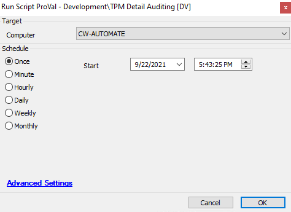

## Summary

This script will provide detailed information about the TPM configuration on the endpoint.

Time Automation: 10 Minutes

## Sample Run

## Dependencies

[TPM Detailed Info](https://proval.itglue.com/DOC-5078775-8304568)

## Variables

| Variable              | Description                                                   |
|-----------------------|---------------------------------------------------------------|
| TPMData               | It collects the complete TPM information                      |
| TPMReady              | This conveys whether TPMReady is Enabled or disabled          |
| TPMPresent            | This conveys whether TPMPresent is Enabled or disabled        |
| ManagedAuthLevel      | This stores the ManagedAuthLevel information                  |
| OwnerAuth             | This stores the OwnerAuth Info                                |
| OwnerClearDisabled     | This contains the detail of whether OwnerClearDisabled or not |
| AutoProvisioning      | It conveys whether auto-provisioning is enabled or not       |
| LockedOut             | This denotes whether TPM is locked or not                     |
| TPMVersion            | This provides the TPM version info                            |

#### Script States

| Name                   | Example                                                                                                      | Description                                               |
|------------------------|--------------------------------------------------------------------------------------------------------------|-----------------------------------------------------------|
| TPMDetail_Info         | @TPMReady@ -- @TpmPresent@ -- @ManagedAuthLevel@ -- @OwnerAuth@ -- @OwnerClearDisabled@ -- @AutoProvisioning@ -- @LockedOut@ -- @TPMVersion@ | This stores the TPM data to be displayed in the dataview. |

## Process

- PowerShell script will gather the relevant TPM details.
- Stores the output of the PowerShell script to a scriptstate. This data is then visible in the [TPM Detailed Info](https://proval.itglue.com/DOC-5078775-8304568) dataview.

## Output

- Script log
- Script state
- Dataview

