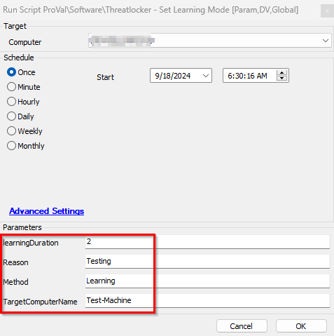
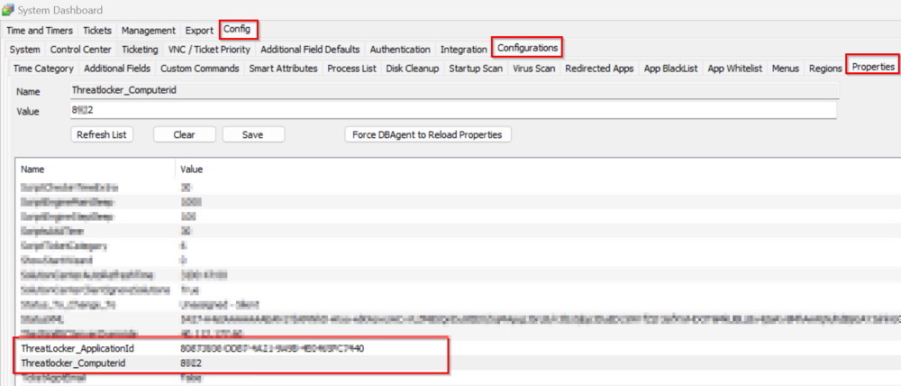

## Summary
This script retrieves API keys from the client's password tab and uses them securely within the script to assist in enabling learning mode for the machine. Each organization has separate API keys (confirmed by ThreatLocker support).

**Note:**  
Please refer to the instructions/FAQ section for creating a new application or using an existing application policy to get the application ID. Ensure to whitelist the file hash for the corresponding application ID rule.

## Sample Run

## Dependencies
- ThreatLocker Authentication keys (must be requested from ThreatLocker support)
  - Maintenance Mode Key
  - Reports Key

## Passwords

| **Password Title**                   | **Description**                                           |
|--------------------------------------|-----------------------------------------------------------|
| ThreatLocker Maintenance Key          | Stores the ThreatLocker maintenance authentication key.   |
| ThreatLocker RepKey                  | Stores the ThreatLocker repository authentication key.    |

## Variables

| **Name**           | **Description**                                                                                     |
|--------------------|-----------------------------------------------------------------------------------------------------|
| MaintKey           | Stores the ThreatLocker maintenance key value from the client's password titled "Maintenance ThreatLocker Key". |
| RepKey             | Stores the ThreatLocker RepKey value from the client's password titled "Maintenance RepKey".       |
| ProjectName        | Sets the name of the PowerShell executable and the directory where the execution record will be stored. |
| WorkingDirectory    | Stores the complete path of the directory where the script will be executed.                       |
| PS1Log            | Stores the path of the text file where the successful logging results of the script will be stored. |
| PS1ErrorLog       | Stores the path of the text file where the failure logging results of the script will be stored.    |
| LogContent        | Stores the success result records of the script execution.                                         |
| ErrorLog          | Stores the failure result records of the script execution.                                         |

## Global Parameters

| **Name**            | **Example**                       | **Required** | **Description**                                                   |
|---------------------|-----------------------------------|--------------|-------------------------------------------------------------------|
| TableName           | pvl_threatlocker-disable_audit    | True         | Stores the table name where the script data will be stored.      |

## User Parameters

| **Name**             | **Example**                | **Required** | **Description**                                                                                     |
|----------------------|----------------------------|--------------|-----------------------------------------------------------------------------------------------------|
| learningDuration      | 1                          | False        | The duration (in hours) for which the learning mode must be set. The default value is 1.          |
| Reason               | Application installation     | False        | Stores the reason for setting ThreatLocker in learning mode. By default, it is set to 'No Reason Provided'. |
| Method               | Learning/Installation        | True         | It is required to set the application control maintenance mode to learning or installation.        |
| TargetComputerName   | TestMachine                 | True         | Provide the name of the target computer where you want to set the ThreatLocker learning/installation mode. |

## Properties

| **Name**                       | **Required** | **Example**                             | **Description**                                                                                      |
|--------------------------------|--------------|-----------------------------------------|------------------------------------------------------------------------------------------------------|
| ThreatLocker_ApplicationId      | True         | XXXX0101-0000-XXXX-1111-XXXX1111XX00   | This ID is required to set maintenance mode using the API instance.                                 |
| Threatlocker_ComputerId         | True         | 680                                     | This is the ID of the computer where only the script will execute. This script shouldn't be run on all local machines; rather, it should run on only one machine whose ID is set in this property. It could be the Automate server for on-prem, and for a Hosted partner, we can ask the partner for approval. |

## Output
- Script log
- pvl_threatlocker-disable_audit (Table)
- Local file on the computer
- Data view

## Instructions/FAQ

**Q: Will ThreatLocker block this script from setting it to learning mode?**  
A: Yes, ThreatLocker will block the .ps1 file generated by this script. To allow the script to work, the partner needs to whitelist the file hash "9FA61A436668967C26CB76858275EC17" and deploy the policy for proper script execution.

**Q: How do I get the ApplicationId?**  
A: Log in to [https://portal.threatlocker.com/](https://portal.threatlocker.com/). Navigate to **Modules → Application Control →**  **→ New Application**. A new tab titled "Create Application" will open.

**Creating the Application**
- The application name can be set to anything.  

  
- Set the application file hash as whitelisted.  
  

- Click "Create Policy."
- Once the policy is created, launch it and set the application ID to the system property "ThreatLocker_ApplicationId."  

- Enter it in **System → Dashboard → Config → Configurations → Properties** in Automate.  

**Q: What are the script dependencies, and what errors can it report?**  
A: Dependencies and errors are as follows:
- For `GET /Reports`: Report AuthKey and ReportId are mandatory.  

- For `POST /MaintenanceMode`: MaintenanceMode AuthKey, ComputerId, ApplicationId, and Method must be set appropriately.  

## Attachments
[MAINTENANCEMODE_-_POST_(1)_(1).pdf](<../../../static/attachments/itg/16557697/MAINTENANCEMODE_-_POST_(1)_(1).pdf>)
[MAINTENANCEMODEBULK_-_POST_1_.pdf](<../../../static/attachments/itg/16557697/MAINTENANCEMODEBULK_-_POST_1_.pdf>)
[REPORTS_-_GET_DATA_(1)_(1).pdf](<../../../static/attachments/itg/16557697/REPORTS_-_GET_DATA_(1)_(1).pdf>)
[REQUESTS_-_GET_(1)_(1).pdf](<../../../static/attachments/itg/16557697/REQUESTS_-_GET_(1)_(1).pdf>)
