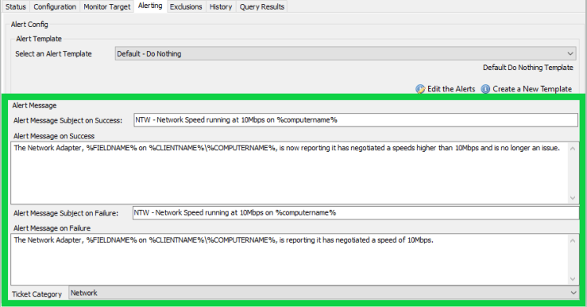
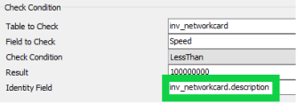
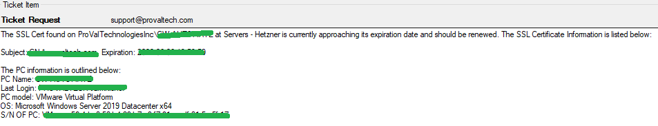
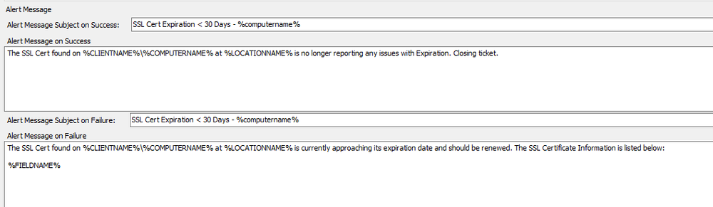

## Summary

This script is designed to be an all-in-one solution that can be used on any monitors built for computers (not client or location monitors) to generate tickets with more information and more useful wording.

## Monitor Driven Only

This script is designed to be monitor-driven only and should never be manually run. If it is manually run, the script will simply exit at the first step in the else section.

This script has been updated to remove the limit of the `%FieldName%` and `%Result%` variables when triggered from a RAWSQL monitor.

## Dependencies

The only dependency for this script is that the Alerting tab must be filled out on the monitor to which you are applying this ticket creation script.

### Things to Note:
1. The 'Alert Message Subject...' for both success and failure MUST be the same; otherwise, there may be issues.
2. The following variables can be used for these messages:
   1. `%FIELDNAME%` - This is the 'Identity Field' value that you assign in the **Configuration Tab** of the monitor (shown in the picture below).
      
   2. `%clientname%` - Displays the client name of the affected machine.
   3. `%locationname%` - Displays the current location of the affected machine.
   4. `%computername%` - Displays the computer name of the affected machine.
   5. `%status%` - Displays SUCCESS or FAILED based on the monitor results.
   6. `%computerid%` - Displays the computer ID of the affected machine.
   7. `%clientid%` - Displays the client ID that the affected machine is associated with.
   8. `%locationid%` - Displays the location ID that the affected machine is in.

## Note

- The Alert Template `△ Custom - Ticket Creation - Computer` runs this script.

## Output

This script outputs logging information into the script log in the scripting tab. It is a simple ticket creation script, so there is not much logging.

## Example Ticket

What the Alerting Tab looks like:

